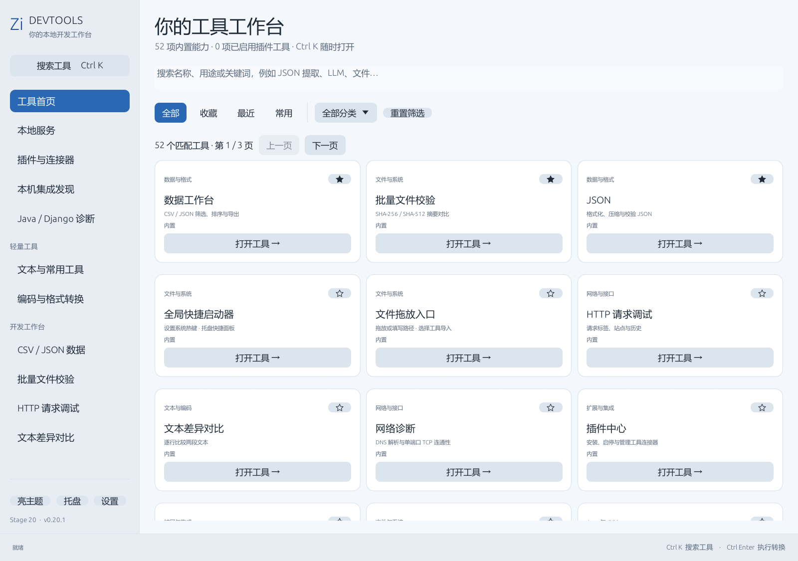
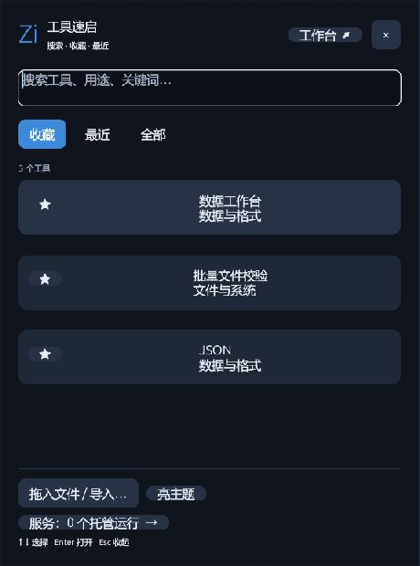
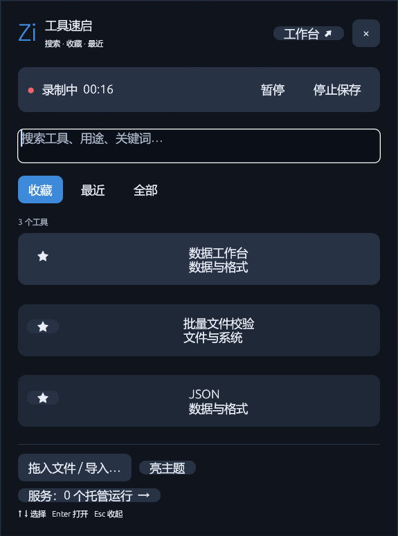
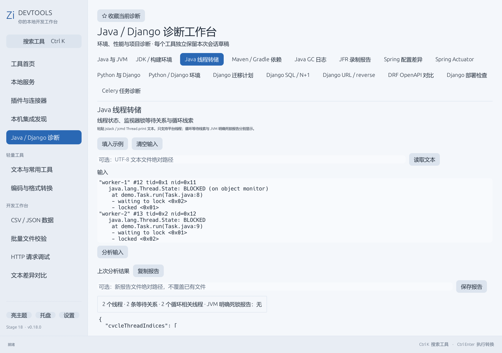
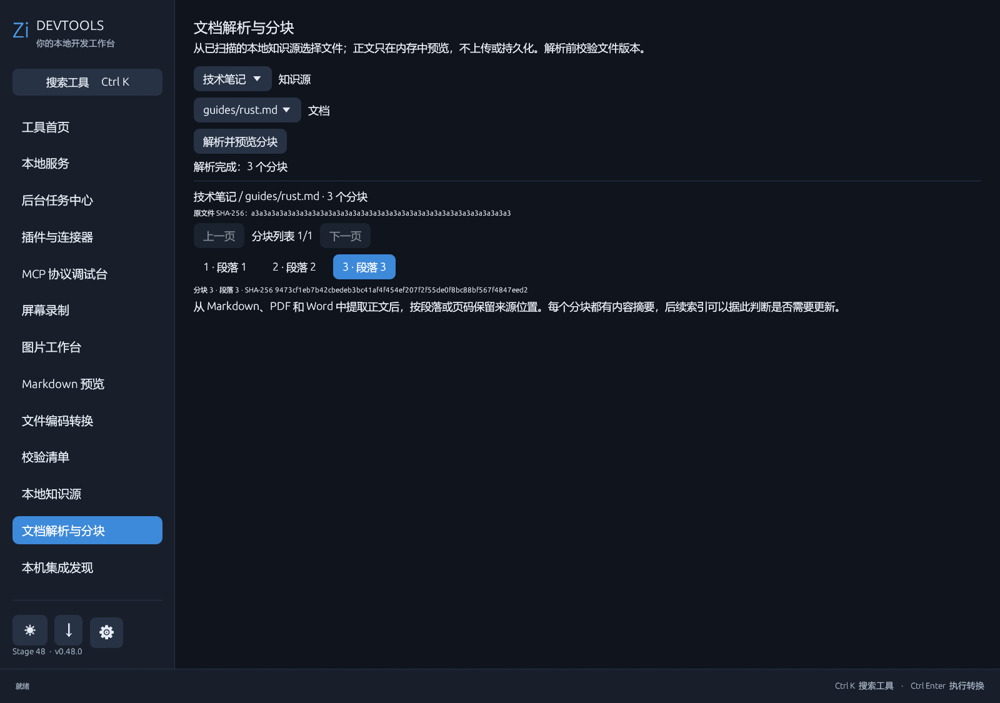
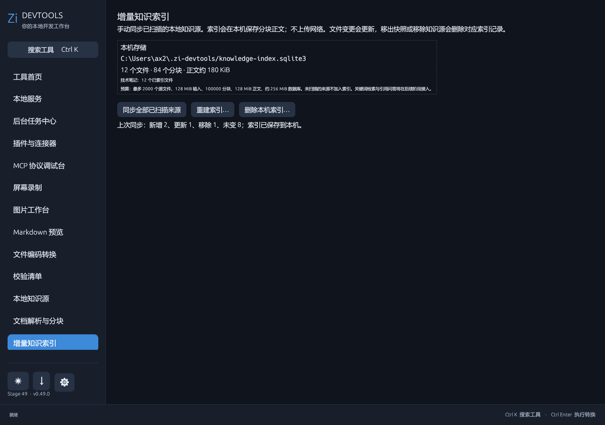
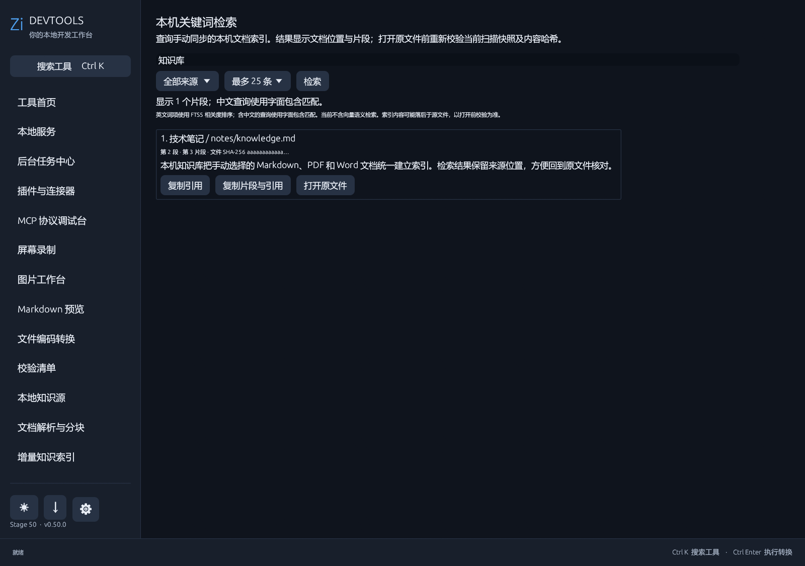
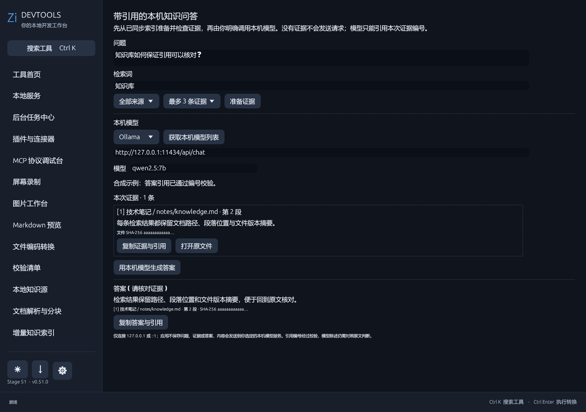
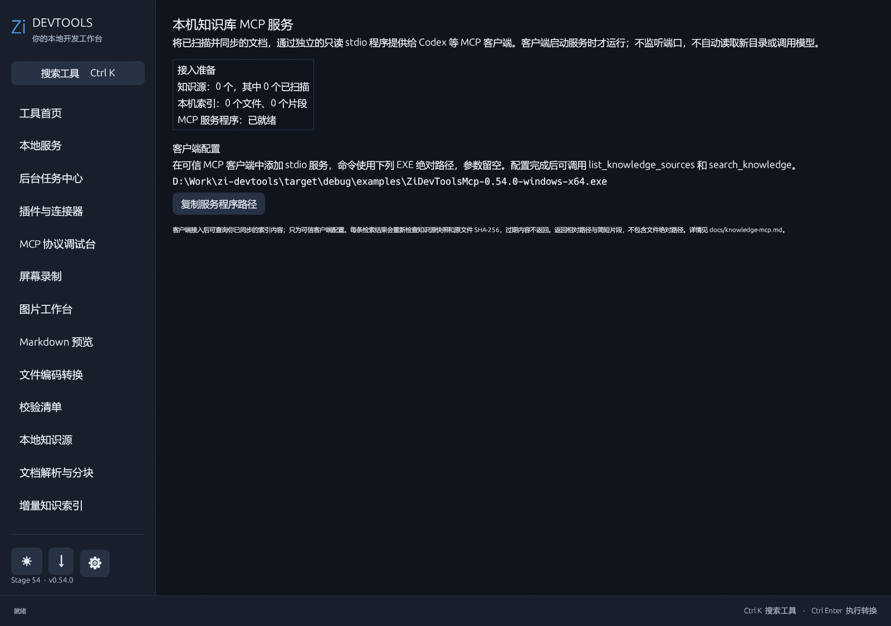
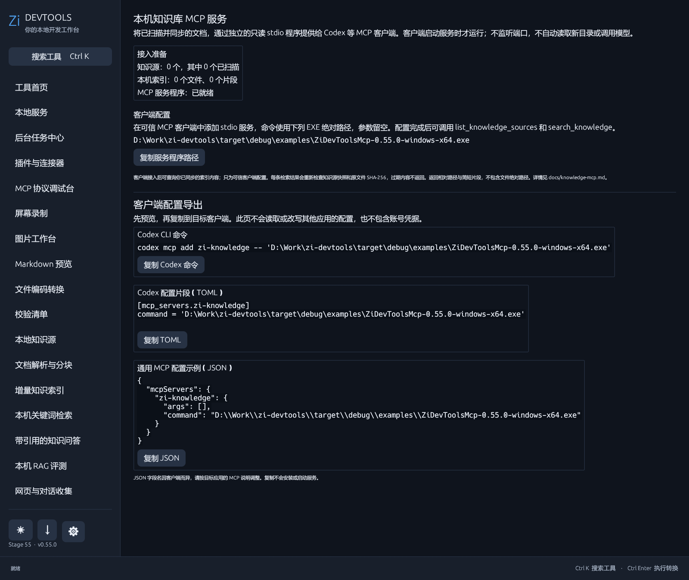

# Zi DevTools

[官网](https://devtools.zicode.com/) · [下载](https://github.com/ax2/zi-devtools/releases/latest) · [已实现工具与规划](docs/tools.md) · [发版流程](docs/releasing.md) · [MIT License](LICENSE)

MIT 开源的 Windows 原生 Rust 桌面开发工具。

Stage 77 / [v0.77.0 已发布](https://github.com/ax2/zi-devtools/releases/tag/v0.77.0)：MCP 调试台新增 2025 版 Streamable HTTP 连接入口，支持 JSON/SSE、逐次确认工具调用、资源和提示词读取，以及取消与响应上限。失效会话会重新初始化，原操作不自动重放。官方 SDK 1.31.0 的 JSON/SSE 合成服务互操作、本地完整检查与安装验收、公开 CI/Release 及四件下载资产摘要均通过。认证、2026 协议与真实业务服务器兼容性待完善。官网更新已暂存，浏览器页面读取超时导致本轮渲染验收和上线切换尚未完成；详见 [MCP 使用说明](docs/mcp-inspector.md)。

Stage 78 开发中：HTTP 调试台新增可主动输入的临时 Bearer 认证，连接后清空编辑框，临时输入不保存，也可主动保存到 Windows 凭据管理器并按完整端点使用；认证失败不会自动重放操作。认证相关集成测试已通过，完整检查和界面验收仍在进行，尚未发版。另增识别服务 401 配置地址提示、逐步读取资源和所选授权服务器配置的 OAuth 信息预览；PKCE/state 与本机随机端口回调基础已通过合成网络测试；令牌交换基础已通过合成请求测试；公共客户端浏览器登录入口和 MCP 连接认证已接入，合成状态测试及明暗主题界面预览通过；客户端注册、自动刷新和完整服务互操作验收仍在推进。



主要能力：

- 读取独立的 `~/.zi-devtools/services.yml`。
- 查看本地服务状态、健康检查、端口、PID、日志与配置文件摘要。
- 启动、停止、重启服务，并保存期望运行状态。
- Windows 系统托盘快速查看与逐项控制服务。
- 仅停止本程序确认托管的进程；遇到外部端口占用时拒绝启动，不会自动结束外部进程。
- 可为单个服务配置优雅停止命令；超时后才强制结束已验证的托管进程树。
- “小工具”包含 JSON、Base64、URL、SHA-256、时间戳、UUID、JWT 内容查看、正则、进制转换和二维码生成／PNG 保存。文件工具支持批量摘要和 [SHA256SUMS 清单生成、验证](docs/checksum-manifest.md)。
- [字符工具集](docs/character-tools.md)提供 ASCII 0–127 码表、特殊字符/表情/颜文字精选库，以及文字和本机图片生成的 ASCII Art；均可从统一搜索、收藏和最近入口打开。
- [SQLite 浏览器](docs/sqlite-browser.md)只读打开本机数据库，查看表/视图结构、有限分页数据，并主动无覆盖导出当前页 CSV；不执行任意 SQL。
- “开发工具”下每个复杂工具有独立菜单项。HTTP 请求调试包含最多 12 个请求标签、站点配置与最近 100 条历史；文本差异对比独立成页。
- 新增独立的“网络诊断”开发工具：DNS 解析与单端口 TCP 连通性测试。小工具新增颜色转换与文本统计；各小工具的输入/输出草稿在本次运行中分别保留。
- 左侧菜单统一左对齐；托盘右键可从收藏、最近、常用或“全部工具”分类直达内置及已启用插件工具并恢复主窗口。
- MCP 协议调试台可明确启动本机 stdio EXE，选择短会话或显式持续连接，检查工具、资源和提示词列表及参数 schema，手动确认工具调用、读取选中资源和获取提示词；当前为开发中能力，详情见 [MCP 使用说明](docs/mcp-inspector.md)。
- MCP 调试台展示服务的只读及外部访问声明；未完整声明低影响的工具需输入完整名称再次确认。实际调用前复核工具完整定义，若描述、schema 或注解变化即拒绝并要求重新检查。
- MCP 工具规则可按本机服务与工具保存“禁止”或“允许声明低影响的只读工具直接调用”；默认仍逐次确认，高影响工具每次输入完整名称。撤销会停止当前会话，调用前重新核对权限；服务程序仍须可信。
- [本机 Agent 任务工作台](docs/agent-workbench.md)可检查已单独授权的只读 MCP 工具，选择本次白名单，让本机 Ollama 拟定计划；用户批准后最多调用四次工具并显示执行结果。知识检索步骤只显示按消息大小选入模型上下文的有界编号来源，完成回答中的 `[K编号]` 须与其对应；模型请求、工具调用与计划可取消。执行终态可预览并主动保存默认不含任务内容及来源路径的 JSON 记录。当前不运行写操作。
- [Agent 记录查看器](docs/agent-record-viewer.md)可导入上述 v1/v2/v3 JSON，也可明确选择目录，在后台有界读取并按时间、状态、模型和工具跨记录搜索；可选两份记录比较工具调用与已报告用量，并主动复制不含正文的摘要。v3 可核对编号来源与答案引用，旧版 v2 仅记录工具返回的来源；任务正文搜索需主动开启，打开记录仍默认隐藏可选内容和来源路径。不连接模型或 MCP，不重新执行工具调用。
- [本机知识库 MCP 服务](docs/knowledge-mcp.md)提供独立只读 stdio EXE，让可信 Agent 列出已扫描知识源、检索手动同步的索引；返回前核验原文件哈希，只给有界片段与相对路径。
- [Embedding 工作台](docs/embedding.md)可明确调用本机 Ollama 对两段文本生成向量，查看维度、范数、余弦相似度和欧氏距离，并复制完整向量；结果只在内存中。[本机向量索引](docs/knowledge-vectors.md)则从已手动同步的知识分块增量生成向量，支持版本校验、取消回滚、语义检索和确认删除；[混合检索工作台](docs/hybrid-search.md)可将两路结果融合并解释排序。
- MCP 接入页可按本机 EXE 路径预览并复制 Codex CLI 命令、Codex TOML 和通用 JSON；不会读取或修改其他客户端配置。
- 屏幕录制支持显示当前屏幕画面的鼠标框选或整屏、H.264 MP4、三档录制质量与文件大小估算、系统声音、麦克风或双声源混音、两路独立录制音量与实时电平、倒计时、暂停/继续、可选录满后自动停止及停止后打开文件；录制中可从托盘、快捷面板或全局热键控制。中断时尽可能保存已录片段；显示器选择已接入，但非主屏仍待实测；见 [录屏说明](docs/recorder.md)。
- 图片工作台在本机读取 PNG/JPEG/WebP：单张可缩放、转换与预览编码大小；批量可先检查名称冲突、再逐项处理；元数据模式可提示常见 EXIF/GPS、ICC、XMP 等信息并预览清理副本。输出不覆盖原图或已有文件。见 [图片工具说明](docs/image-tools.md)。
- Java 与 Django 诊断分开导航；左下角主题、托盘、设置为图标按钮，悬停可查看说明。隐藏到托盘时移除主窗口任务栏样式，恢复时还原。
- [网页与对话收集](docs/knowledge-capture.md)可粘贴 Agent 结果、导入 HTML 或抓取公开 HTTPS 网页，预览后保存到本机目录知识源或 Zi 收集箱。[本地知识源](docs/knowledge-sources.md)可明确添加文件或目录、排除不需要的内容并手动扫描版本清单；[文档解析与分块](docs/document-ingestion.md)可从快照选择 Markdown、文本、网页、PDF 或 Word，校验版本后预览带位置与哈希的分块。[本机关键词检索](docs/knowledge-search.md)可查询索引、复制引用并核验原文件；[混合检索工作台](docs/hybrid-search.md)可将关键词与本机向量结果按可解释权重融合。[带引用的知识问答](docs/knowledge-answer.md)可明确选择关键词或混合证据，预览有限证据后调用本机模型，并拒绝虚构引用编号；[本机 RAG 评测](docs/knowledge-eval.md)可用固定样例集对照两种检索的 Top K 命中与名次，或评测所选证据的引用和答案字面片段。
- [磁盘维护](docs/maintenance.md)提供构建增量缓存的预览、手动清理和每周计划任务；每月首次成功运行时清理完整构建缓存，错过首周也会补做，并记录最近一次结果。阶段发布包、用户配置与知识数据始终保留。
- [目录空间分析](docs/disk-inspector.md)在用户选择目录后后台只读统计大目录与大文件，支持取消，并将链接、权限错误或扫描上限导致的不完整结果明确标出；不自动删除文件。
- [重复文件检查](docs/duplicate-finder.md)先按大小筛选，再对候选文件流式计算 SHA-256；显示可核对的文件组和理论重复逻辑大小，支持取消并标出未覆盖范围，不自动删除。
- [目录内容对比](docs/directory-compare.md)按相对路径对照两个目录，以类型、大小和 SHA-256 区分差异；部分扫描不会误报单侧缺失，可筛选并主动导出差异 CSV，不同步或删除。
- [增量知识索引](docs/knowledge-index.md)在用户手动同步时将已扫描文档写入本机 SQLite 全文索引，支持增量更新、删除同步、回滚与重建；正文可在工具中确认后删除。
- 托盘右键“本地服务”子菜单汇总所有服务、状态与批量启停；HTTP 历史可搜索，清空时需要二次确认。
- HTTP 请求头、请求体和响应只保存在当前进程内存；站点只保存名称与基础地址，历史只保存方法、去掉查询参数的 URL、状态和耗时，存于 `%USERPROFILE%\.zi-devtools\http-workbench.json`。历史重新打开不会恢复认证信息；URL 路径如含敏感值仍应避免使用历史记录。

## 开发

```powershell
cargo run
cargo test
cargo build --release
```

默认配置路径为 `%USERPROFILE%\.zi-devtools\services.yml`。服务 YAML 的 `env` 字段只用于启动进程，不在 UI 展开；`config_files` 明确列出的文件仍可由用户手工预览。程序不会把环境变量值写入项目档案。

项目完全独立，不依赖任何公司项目、私有包、私有配置或公司运行环境。服务管理模型和实现均保存在本仓库内。

可选启动参数：

```powershell
ZiDevTools.exe --config C:\path\to\services.yml --no-restore
```

`--no-restore` 会跳过启动时的期望服务恢复，适合只读检查配置和状态。

从另一份兼容 YAML 一次性导入服务定义：

```powershell
ZiDevTools.exe --import-config C:\path\to\existing-services.yml
```

导入时会改用 Zi DevTools 自己的状态目录，不复制旧 PID、日志或期望运行状态。目标文件已存在时，需要显式增加 `--force-import`。

服务可选配置 `stop_command` 和 `stop_timeout_ms`（100–60000，默认 5000）。停止命令在该服务的工作目录与环境变量下执行；仅当服务由 Zi DevTools 托管时才运行。停止命令退出但服务仍运行、或达到超时后，将回退到强制停止。未配置停止命令的服务保持原有强制停止方式。停止命令应由用户针对服务自身支持的停机接口编写，不要在命令中嵌入凭据。

## 托盘快捷访问

左键打开独立快捷面板，右键打开原生快捷菜单。默认 `Ctrl+Alt+Space` 可从其他应用唤起面板，设置中可以修改或关闭；发生冲突会提示并保留旧绑定。收藏按添加顺序，最近按打开时间，常用按打开次数；分别显示前 8 / 8 / 6 项，并提供完整列表入口。支持搜索、统一分类和设置。停用插件从可用入口隐藏，重新启用后保留收藏。菜单外观跟随 Windows；主窗口独立支持明暗主题。

[交互说明与限制](docs/tray-navigation.md)

## 文件拖放与快捷面板

拖入文件到主窗口或快捷面板，即可选择数据表、JSON、Java / Django 日志诊断或文件校验。也可在“文件拖放入口”填写路径。导入前明确提示目标草稿替换；运行中的目标任务不会被覆盖，原文件不修改。多个文件加入校验列表后再手动开始。

快捷面板支持明暗主题、搜索、收藏、最近、上下键与 Enter；Esc 或失去焦点后收起。面板独立显示，主工作台的尺寸和位置保留。全局热键不等同于应用内 Ctrl K。

录屏运行时，快捷面板还可查看计时、暂停、继续或停止保存；倒计时中可取消。





## 交付状态

Stage 76 / [v0.76.0 已发布](https://github.com/ax2/zi-devtools/releases/tag/v0.76.0)：MCP 协议调试台增加可显式保持的本机 stdio 连接，在同一进程内连续操作，逐次复核工具定义和权限，支持手动断开与闲置退出。本地完整测试、Windows 安装/卸载、公开 CI/Release 与下载资产哈希已核对；官网四个线上文件与源码快照哈希一致。Streamable HTTP、心跳和真实第三方服务兼容性仍在规划。详见 [使用说明](docs/mcp-inspector.md)。

Stage 75 / [v0.75.0 已发布](https://github.com/ax2/zi-devtools/releases/tag/v0.75.0)：新增只读 SQLite 浏览器；本地完整测试、Windows 安装/卸载、公开 CI/Release、资产摘要与官网桌面/手机视口均已核对。服务测试的并行端口竞态已修复。

Stage 74 / [v0.74.0 已发布](https://github.com/ax2/zi-devtools/releases/tag/v0.74.0)：新增双目录只读内容对比与有界差异 CSV；完整测试、Windows 安装/卸载、公开 CI/Release 与资产哈希、官网桌面/手机视口均已核对。部分扫描不误报单侧缺失。

Stage 73 / [v0.73.0 已发布](https://github.com/ax2/zi-devtools/releases/tag/v0.73.0)：新增 ASCII 码表、特殊字符/表情/颜文字库和 ASCII Art；完整测试、Windows 安装/卸载、公开 CI/Release 与资产哈希、官网桌面/手机视口均已核对。两阶段交付后安全清理约 14.92 GiB 可重建构建缓存，阶段完整目录保留。

Stage 72 / [v0.72.0 已发布](https://github.com/ax2/zi-devtools/releases/tag/v0.72.0)：新增有界只读重复文件检查，公开 CI/Release、Windows 安装/卸载、资产哈希和官网桌面/手机视口已验证。工具不自动删除，理论重复逻辑大小不等于实际可释放空间。

Stage 71 / [v0.71.0 已发布](https://github.com/ax2/zi-devtools/releases/tag/v0.71.0)：新增只读目录空间分析，按直属子目录与最大文件展示已统计逻辑大小，明确链接、权限、扫描上限与取消造成的部分结果。完整本地测试、Windows 安装/卸载、公开 CI/Release 与资产哈希、官网桌面/手机视口均已核对。本轮安全清理约 10.08 GiB 构建缓存。

Stage 70 / [v0.70.0 已发布](https://github.com/ax2/zi-devtools/releases/tag/v0.70.0)：知识 MCP 命中按 3 KiB 模型消息装箱，仅为选入的片段分配 `[K编号]` 并校验完成回答的引用；默认私有记录及 v1/v2/v3 查看器通过测试。完整本地与公开 CI/Release、Windows 安装/卸载、公开资产哈希及官网桌面/手机视口均已核对。失败或取消时最近一步消息可能尚未发送；编号有效不证明答案事实正确。本轮安全清理约 11.45 GiB 构建缓存。

Stage 69 / [v0.69.0 已发布](https://github.com/ax2/zi-devtools/releases/tag/v0.69.0)：Agent 知识检索来源按步骤追踪，默认不含来源路径的 v1 记录与主动包含来源的 v2 记录可在查看器回看；完整本地测试、Windows 安装包、公开 CI/Release 资产哈希及官网桌面/手机视口均已核对。来源是工具声明，不作为答案引用的事实证明。

Stage 68 / [v0.68.0 已发布](https://github.com/ax2/zi-devtools/releases/tag/v0.68.0)：Agent 记录目录可选择基线和候选进行元数据对比；工具并集、未知用量、摘要隐私、异常数值、完整测试、Windows 安装包、公开 CI/Release 资产哈希和官网桌面/手机视口均已核对。

Stage 67 / [v0.67.0 已发布](https://github.com/ax2/zi-devtools/releases/tag/v0.67.0)：Agent 记录查看器可明确选择目录并跨记录检索；单份与目录边界、后台读取、搜索隐私开关、完整测试、Windows 安装包、公开 CI/Release 资产哈希和官网桌面/手机视口均已核对。

Stage 66 / [v0.66.0 已发布](https://github.com/ax2/zi-devtools/releases/tag/v0.66.0)：Agent 记录查看器支持有界导入和只读回看，已接入工具搜索入口；完整本地测试、Windows 安装包及静默安装/卸载、公开 CI/Release 资产哈希和官网桌面/手机视口均已核对。

Stage 65 / [v0.65.0 已发布](https://github.com/ax2/zi-devtools/releases/tag/v0.65.0)：Agent 单次运行记录增加默认不含目标、计划、答案及服务路径的 JSON 预览与显式保存；额外内容须单独勾选。完整测试、Windows 安装包、公开 CI/Release 资产哈希和官网桌面/手机视口均已核对。

Stage 64 / [v0.64.0 已发布](https://github.com/ax2/zi-devtools/releases/tag/v0.64.0)：本机 Agent 任务工作台可在人工批准后调用本次白名单中已直接授权的低影响只读 MCP 工具；一次性模型/MCP 夹具和真实 `qwen2.5:7b` 合成资料通过。完整本地测试、格式、Clippy、release 构建、静默安装/卸载、公开 CI 与 Release 资产哈希，以及官网桌面与手机视口均已核对。详见 [使用说明](docs/agent-workbench.md)。

Stage 63 / v0.63.0 [已公开发布](https://github.com/ax2/zi-devtools/releases/tag/v0.63.0)：MCP stdio 调试台加入按服务与工具定义绑定的持久规则、调用前二次复核和撤销；一次性协议夹具、公开 CI/Release、四件下载资产哈希及官网桌面/手机验证通过。本轮安全清理约 13.14 GiB 构建缓存。当时尚未接入 Agent 自动调用。

Stage 62 / v0.62.0 [已公开发布](https://github.com/ax2/zi-devtools/releases/tag/v0.62.0)：固定 RAG 样例集可同题比较关键词与混合检索的预期来源名次、独有/共同命中和 MRR；模型/索引错误不计成对结果。单路模型评测也可选混合证据；一次性夹具、真实本机双模型测试、公开 CI/Release、四件下载资产哈希及官网桌面/手机验证通过。本轮安全清理约 10.57 GiB 构建缓存。

Stage 61 / v0.61.0 [已公开发布](https://github.com/ax2/zi-devtools/releases/tag/v0.61.0)：带引用问答新增关键词/混合证据模式、独立嵌入模型、可取消证据准备与两路贡献说明；一次性 HTTP 夹具和本机 `bge-m3:latest` + `qwen2.5:7b` 合成文档端到端、公开 CI/Release、四件下载资产哈希及官网桌面/手机验证通过。固定样例评测仍按关键词基线。

Stage 60 / v0.60.0 [已公开发布](https://github.com/ax2/zi-devtools/releases/tag/v0.60.0)：新增关键词与语义双通道混合检索、可调 RRF 权重、来源筛选、结果贡献解释与版本复核。本机服务夹具及 `bge-m3:latest` 合成文档测试、公开 CI/Release、四件下载资产哈希及官网桌面/手机验证通过；带引用问答尚未使用混合结果。

Stage 59 / v0.59.0 已公开发布：新增可选本机向量索引及语义检索；一次性 HTTP 夹具验证增量、版本变更、取消回滚，本机 `bge-m3:latest` 对两份合成文档完成真实索引与查询，公开 CI/Release、四件下载资产及官网桌面/手机验证通过。

Stage 58 / v0.58.0 已公开发布：新增本机 Embedding 工作台；本机 `bge-m3:latest` 的真实两文本嵌入和数值校验、公开 CI/Release、安装包以及官网桌面/手机验证通过。

Stage 57 / v0.57.0 已公开发布：MCP 调试台新增工具只读声明展示、未声明只读时的名称确认，以及调用前的完整工具定义复核。调试台仍是手动短会话，第三方服务兼容性与完整权限系统继续规划。

Stage 56 / v0.56.0 已公开发布：知识库 MCP 两个工具增加只读协议注解，Codex TOML 限定工具并采用 writes 审批模式；本机隔离的 Codex CLI 真实会话已成功列出空来源并检索合成文档。

Stage 55 / v0.55.0：新增 MCP 客户端接入向导，按实际程序位置预览 Codex 命令、TOML 和通用 JSON，确认后复制，不自动改写其他应用配置。

Stage 54 / v0.54.0：新增本机知识库 MCP 只读服务，独立控制台 EXE 供可信客户端检索已同步文档，逐条复核当前文件并返回有界引用。

Stage 53 / v0.53.0：新增网页与对话收集，可粘贴文字或 HTML、导入本机 HTML、明确抓取公开 HTTPS 网页；预览后保存为本机知识源 Markdown，支持 Zi 收集箱和同内容去重。仍需手动扫描与索引，浏览器扩展未实现。

Stage 52 / v0.52.0：新增本机 RAG 固定样例评测，可先离线检查预期文件是否进入证据 Top K，再明确调用本机模型逐题检查有效引用与答案字面片段；取消后保留已完成结果，报告仅在指定新文件时导出。指标用于回归，不能替代语义核对。

Stage 51 / v0.51.0：新增带引用的本机知识问答，先准备并核验本机证据，再由用户明确调用回环地址的 Ollama/OpenAI 兼容模型；答案 JSON 的引用编号必须属于本次证据，证据不足、过期或不合约时不呈现断言性答案。向量召回与语义事实核验仍在规划。

Stage 50 / v0.50.0：新增本机关键词检索，提供来源筛选、有限结果、位置片段、引用复制和原文件版本校验；英文使用 FTS5 相关度，中文使用字面包含匹配。向量混合检索和问答仍在规划。

Stage 49 / v0.49.0：新增手动增量知识索引，SQLite FTS5 持久化已扫描文件的分块正文，支持增量更新、删除同步、事务回滚、重建和删除索引；加入安全的每周磁盘维护计划任务。

Stage 48 / v0.48.0：从已扫描的本地知识源解析 Markdown/TXT/HTML/PDF/DOCX，解析前校验文件版本，按页或段落预览带 SHA-256 的内存分块；索引、检索和问答继续规划。

Stage 47 / v0.47.0：增加本地知识源管理，用户明确添加来源、设置排除规则并手动有界扫描；记录 SHA-256 版本和新增/变化/移除，不保存文档正文。解析、索引和问答继续规划。

Stage 46 / v0.46.0：增加 SHA256SUMS 清单生成与逐项验证，后台计算、预览后无覆盖另存；清单限制在同一目录的普通文件，拒绝路径穿越与符号链接。

Stage 45 / v0.45.0：新增文件编码检查与转换，区分 BOM 确定结果与启发式推测，支持手选 UTF-8、UTF-16、GB18030、Big5、Shift_JIS、Windows-1252；严格解码、目标字节与 SHA-256 预览后另存，拒绝字符替换和文件覆盖。

Stage 44 / v0.44.0：新增本机 Markdown 预览，支持文件读取或粘贴草稿，按结构阅读并生成带 CSP 的自包含 HTML。原始 HTML 被转义，图片不加载，危险链接不变成可点击目标；确认后另存新文件，拒绝覆盖。

Stage 43 / v0.43.0：图片工作台增加可视化裁剪、黑色遮挡、箭头和文字标注，按原图分辨率生成最终编码预览和实际大小，再确认另存新文件。读取时应用 EXIF 方向，动画图片拒绝处理；中文标注使用本机字体，缺字会明确提示。

Stage 42 / v0.42.0：图片工作台增加本机元数据检查与清理副本。识别常见 EXIF/GPS、ICC、XMP、文本/IPTC，按 EXIF 方向重新编码并复检输出；动画图片拒绝处理，私有未知元数据不保证完全识别。

Stage 41 / v0.41.0：图片工作台新增最多 100 张图片的批量转换、输出清单与重名冲突预检、逐项结果和取消余下任务；始终新建输出文件，拒绝覆盖。复杂图片组合和长批次仍需更多实测。

Stage 40 / v0.40.0：录屏框选显示选定屏幕的当前画面、三档质量与大小预估、开始/暂停/停止全局快捷键；关闭主窗口后修复任务栏残留样式。Java/Django 分页入口、底部图标与本地图片工作台同步完成。短时静态录制表明实际大小可能远小于目标码率估算，页面对此明确提示；物理热拔插、副屏和更多设备仍待验证。

Stage 39 / v0.39.0：录制中画面捕获意外结束、音频采集失败或显示器拓扑改变时，尽可能完成已有片段封装，明确显示中断原因并保留打开视频、打开文件夹入口。真实主屏桌面录制中注入画面和麦克风中断，均得到带 MP4 索引的文件；没有真实拔插显示器。编码失败或没有画面帧时不能保存片段。

Stage 38 / v0.38.0：录屏可选录满 1/5/15/30/60 分钟后自动停止并保存，默认关闭，暂停和倒计时不计入时长；选择保存在本机偏好中。真实 1 分钟录制中途暂停 3 秒，约 63.18 秒后自动保存。主屏当前声卡的 120 秒双声源录制与 3 秒暂停完成 MP4 封装，音画轨差约 0.073 秒；更长时长与其他设备仍待验收。

Stage 37 / v0.37.0：MCP stdio 调试台将工具、资源和提示词分开访问；明确选择后可读取已列资源内容、获取提示词消息。每次操作重新检查目标，使用短会话、有界消息及取消清理；远程 HTTP、持久会话和第三方兼容性仍在规划。

Stage 36 / v0.36.0：快捷面板在录屏中显示状态和计时，可暂停、继续、停止保存或取消倒计时；真实 eframe 鼠标点击验证深浅主题和窗口恢复。主屏 60 秒动态窗口录制的麦克风单路和系统声＋麦克风混录均完成 MP4 封装，音视频轨差分别为约 0.127 秒和 0.072 秒。不同设备、热拔插及更长时间仍待验收。

Stage 35 / v0.35.0：修复主工作台隐藏到托盘后快捷面板无法唤醒；Windows 使用 DWM cloak 隐藏工作台并保持事件处理，不支持时退回最小化。真实 eframe 窗口已验证深浅主题快捷面板与录屏自动最小化恢复。正式安装包以 [GitHub Releases](https://github.com/ax2/zi-devtools/releases) 为准。

Stage 34 / v0.34.0：录屏可在开始时自动最小化主窗口，并在取消、失败或保存完成后恢复；托盘不可用时保留窗口按钮。真实 eframe 窗口的立即开始、倒计时和取消路径已验证。正式安装包以 [GitHub Releases](https://github.com/ax2/zi-devtools/releases) 为准。

Stage 33 / v0.33.0：录屏在静态桌面期间补送当前帧，保持视频时间线连续；主屏的四种声音模式短录、12 秒静态桌面和动态窗口音画轨同步已实测。更长时间、不同设备、非主屏和混合 DPI 待验收，相关能力保持“进行中”。

Stage 32 / v0.32.0：录屏可按设备名选择显示器；框选窗口按物理边界放置，录制前复核拓扑变化。当前主屏真实测试通过，非主屏、混合 DPI 与跨屏合成未验证或未实现，因此显示器选择保持“进行中”。

Stage 31 / v0.31.0：录屏新增系统声与麦克风实时短时峰值电平，静音或暂停时归零；受控本地音调使系统声电平有响应，麦克风独立实声验证和长时设备同步仍待验收。正式安装包以 [GitHub Releases](https://github.com/ax2/zi-devtools/releases) 为准。

Stage 30 / v0.30.0：录屏增加系统声与麦克风独立 0–200% 增益、单路静音和混音削波保护；双设备准备完毕后启动采集。四种模式真实桌面短录制、音画时长、深浅主题截图、MSI 安装/卸载已完成本地验证；公开发布状态以 [GitHub Releases](https://github.com/ax2/zi-devtools/releases) 为准。实时电平、长时设备同步和跨显示器仍在规划。

Stage 25 / v0.25.0：受支持文本插件加入本地提示词模板库，支持命名、标签搜索、变量预览、修订差异及明确应用正文/同工具运行参数；模型对话仍在开发中，真实模型生成和完整点击交互待验收。

Stage 24 / v0.24.0：文本插件多轮模式增加本地命名会话库。只有主动保存才会将成功问答写入本机插件数据目录；可刷新列表、预览、确认恢复与二次确认删除，不自动发送请求或保存凭据、未发送草稿。模型对话仍在开发中，真实模型服务兼容性待验收。

Stage 23 / v0.23.0：受支持的文本插件可使用内存多轮上下文、流式输出与停止、Markdown/JSON 会话导出、JSON 预览确认恢复和有界 UTF-8 文本附件。模型对话工具仍在开发中，真实模型服务兼容性、PDF/Word/图片解析和更多会话管理待验证或实现。正式安装包以 [GitHub Releases](https://github.com/ax2/zi-devtools/releases) 发布结果为准。

Stage 22 / v0.22.0：插件凭据、工具连接设置、命名档案与 OpenAI/Ollama 模型发现已完成本地验证。正式安装包以 [GitHub Releases](https://github.com/ax2/zi-devtools/releases) 发布结果为准；通用设置 schema 与多轮/流式对话仍在规划中。

Stage 21 / v0.21.0：Windows 可运行目录 `dist\Stage-21`；公开安装包以 [GitHub Release](https://github.com/ax2/zi-devtools/releases/latest) 为准。

Stage 21 新增：结果互传已接入文本工具、数据导出、HTTP 完整响应与诊断报告；预览后明确替换目标输入；数据工作台增加列转换、两表合并与关联、后台预览和单步撤销；任务中心支持数据解析/合并与文件校验，本地验收通过。[数据处理说明](docs/data-workbench.md)。

- **Stage 20 快捷入口**：全局热键、独立托盘快捷面板、文件拖放与导入；原生右键菜单保留。合并重复 SQLite 规划。
- **Java / Django 专项**：原有 14 项规划均已提供首版入口；独立诊断工作台、分类/收藏/最近/Ctrl K/托盘直达、后台任务、文件导入与报告保存。[支持格式与使用说明](docs/java-django-tools.md)。环境检查与 JFR 需要所选可信 JDK/Python；日志分析不需要安装它们。
- **Java / Django 诊断**：离线 Java 异常链、Django / Python Traceback 整理，输出结构化帧与规则提示；[开发价值与路线](docs/java-django-roadmap.md)。不运行用户项目，不把异常链末端当作已确认根因。
- **体验优化**：目录每页 18 项；筛选自动回到首页；插件离页后仍收取结果并提示；运行时参数锁定、模型必填检查、结构化错误摘要与复制反馈；清单浏览避免反复复制请求体。
- **统一目录**：十类分类、收藏、最近 20 项、按打开次数排序的常用视图；关键词搜索与 Ctrl K 同时覆盖内置和插件工具。
- **插件机制**：JSON 清单预览、安装、启停、刷新、卸载与内容指纹。支持内置配方和非流式 HTTP JSON 适配器，输入/结果不落盘；令牌可临时使用，或显式保存到 Windows 凭据管理器（v0.22.0）。[插件使用与开发](docs/plugins.md)。
- **可选连接器**：3 个示例包、6 项工具，覆盖本地文本、Ollama、OpenAI 兼容服务。需要已有服务与模型，不自动下载或启动。
- **本机发现**：只读检查 PATH 入口和常见服务端口；本次调查发现 Ollama、AnythingLLM、Codex CLI、Docker 等，具体运行与集成边界见 [架构与路线](docs/platform-roadmap.md)。
- **扩展规划**：覆盖模型、MCP、RAG、Agent、插件生态和本地数据能力；已实现与规划数量由下方工具清单自动生成。模型连接器不等于完整 Agent/MCP/RAG。
- 现有 28 项轻量工具、CSV/JSON 工作台、文件校验、HTTP、差异、网络诊断及服务管理。数据操作限制见工具文档。















验证：Rust 单元测试、Windows 生命周期与 MCP 集成测试、fmt、Clippy、界面截图、安装包和发布工作流；具体证据见 [发版说明](docs/release-notes.md)。全局快捷面板已实现；所选本机服务进程不提供沙箱。

开发档案保留在本地，公开仓库只发布源码、产品文档和可分享的测试说明。

## 工具规划与同步

<!-- tools-summary:start -->
当前包含 **30 个小工具、27 个开发工作台和本地服务管理**，另有 **46 项规划 / 开发中能力**。完整列表见 [工具清单](docs/tools.md)。

优先推进：模型连接配置、多轮模型工作台、提示词模板库、MCP 连接管理、MCP 协议调试台、MCP 工具权限、插件版本与更新、插件设置与凭据等；完整优先级见清单。规划不代表已实现。
<!-- tools-summary:end -->

清单以 `docs/tools.json` 为唯一来源，运行 `python scripts/sync_tools.py` 更新文档。CI 校验源码入口、清单和生成文档，具体规则见工具清单末尾。
