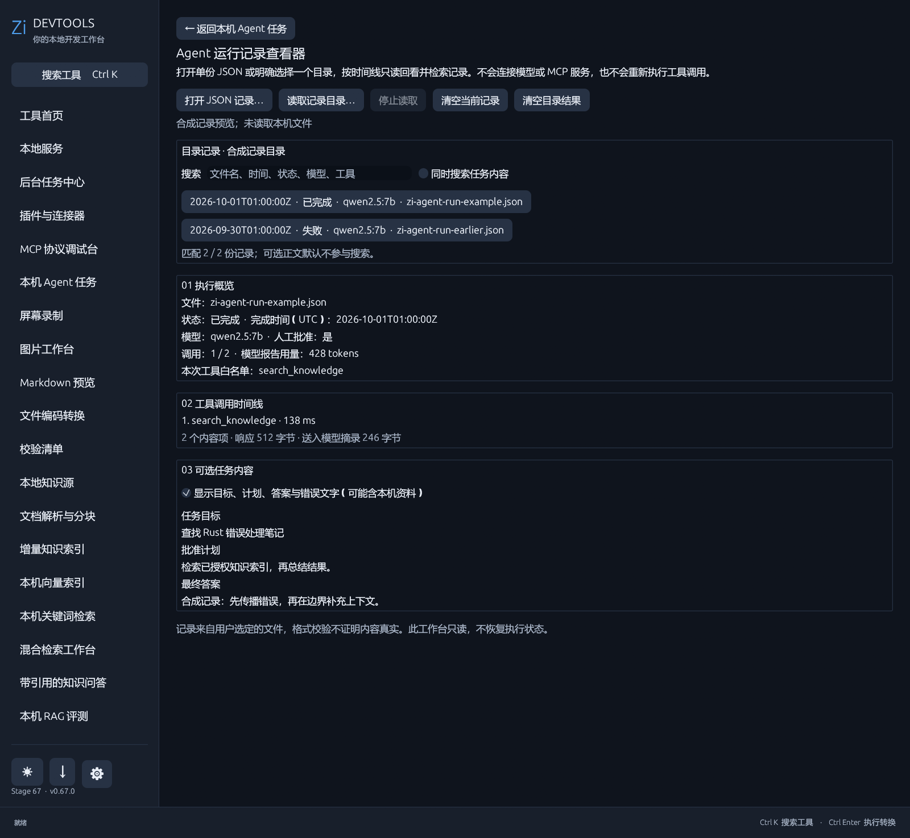

# Agent 记录查看器

在工具首页搜索“Agent 记录”，或从本机 Agent 任务页面进入。选择由 Zi DevTools 导出的 JSON 文件后，可查看结束状态、UTC 时间、所用本机模型、本次已批准工具白名单、调用预算、逐步耗时、内容项及响应大小。失败或取消记录没有最终模型用量时显示“未知”，不会补造数据。

记录文件最多 1 MiB。查看器只接受 `zi-devtools-agent-run` 的 schema v1，检查批准标志、状态、白名单、步骤数量和工具归属，拒绝不认识的字段或版本。单份导入失败时保留原先已打开的记录；点击“清空当前记录”可从当前窗口移除。应用只显示文件名，打开单份文件不会扫描其他文件，也不会自动保存或把记录放入长期历史。

包含目标、计划、答案或错误文字的记录默认不显示这些内容，需单独勾选“显示可选内容”。导入文本按普通文字展示，不当作命令或 HTML 执行。查看器不连接 Ollama 或 MCP，不调用工具，也不恢复执行状态。JSON 由用户提供，结构校验不等于来源认证；证据来源关联和任务恢复尚未实现。

也可以明确选择一个目录，在后台仅读取顶层 `.json` 文件，最多 64 份、累计 16 MiB；不递归、不自动持续扫描。无效或超限文件会计数，不展示其内容。有效记录按结束时间倒序排列，可搜索文件名、时间、状态、模型和本次工具白名单；“同时搜索任务内容”需要主动勾选。切换记录后可选目标、计划、答案和错误文字再次默认隐藏。读取中可停止，也可清空目录结果；列表和记录仅保留在当前窗口内。
