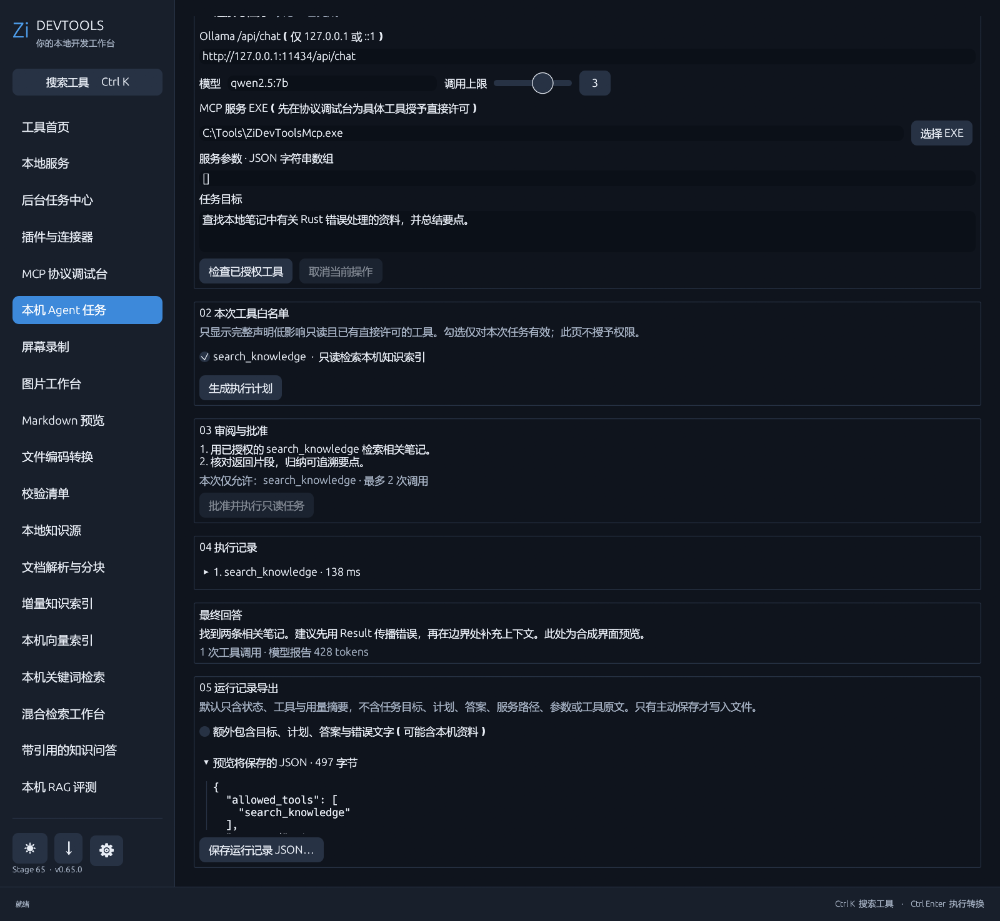

# 本机 Agent 任务工作台

从工具首页搜索“Agent”或左侧“本机 Agent 任务”进入。此工作台只连接本机回环地址的 Ollama `/api/chat`；默认模型 `qwen2.5:7b` 可改为本机已安装模型。MCP 目标须为可信的绝对 EXE 路径，参数填写 JSON 字符串数组。工作台不会自动发现或安装模型与服务。

先到 [MCP 协议调试台](mcp-inspector.md)检查目标服务和工具定义，并为需要的工具逐项选择“允许声明低影响的只读工具直接调用”。Agent 只列出同时具有 `readOnlyHint=true`、`destructiveHint=false`、`openWorldHint=false` 声明，且当前完整定义已获直接许可的工具。服务端声明不是沙箱或代码审计；只对可信服务授权。可选用同目录的 [Zi 知识库 MCP 服务](knowledge-mcp.md)读取已手动同步的本机索引。

在工作台填写目标、选择本次工具白名单和最多 1–4 次调用，点击“生成执行计划”。规划请求不附带工具，模型只能生成可审阅的文字；此时没有调用 MCP 工具。确认计划后点击“批准并执行只读任务”，才会向模型提供所选工具 schema。每次调用都必须匹配白名单，重新核对服务程序和直接文件参数、完整工具定义与当前权限文件；模型要求其他工具、一次多个调用、工具定义改变或权限撤销时，任务直接停止。改变输入、模型、服务或白名单会废弃旧计划。

任务显示草稿、检查、规划、待批准、执行、完成、失败和取消状态，以及每次工具的耗时与不含原始内容的结果摘要。模型每轮最多生成 512 tokens，总计上限为模型报告的 12000 tokens；请求最多 64 KiB，响应最多 128 KiB，工具参数最多 8 KiB，送回模型的单次工具结果摘录最多 3 KiB。单个模型请求最长 45 秒，MCP 检查最长 15 秒、调用最长 30 秒。用户可取消当前模型请求或 MCP 短会话；已经交给外部服务的操作无法回滚。

计划、结果与执行记录默认仅在当前进程内存中，不自动写文件、其他应用配置或长期历史。执行完成、失败或取消后，可在“运行记录导出”中预览 JSON 并主动选择保存路径。默认文件只含状态、模型名、已批准的工具名、调用耗时、内容项数量/结果字节摘要及成功时模型报告的 token 用量；不含任务目标、计划、答案、错误文字、服务程序/权限路径、工具参数或 MCP 原始结果。勾选“额外包含”才写入目标、计划、答案与错误文字，保存预览与最终文件内容一致。失败或取消时 token 用量显示为 null，不推断未收到的模型统计。编辑任务输入会废弃旧记录。导出的工具名等元数据也可能敏感，分享前请检查。

任务工作台不导入记录或自动重放任务；当前只支持本机 Ollama + 本机 stdio MCP 的有限只读任务，不支持写操作、后台自主运行、费用计费、断点恢复或其他客户端审批。
导出的 JSON 可在独立的 [Agent 记录查看器](agent-record-viewer.md)中只读打开和按步骤查看；查看器不会恢复或重新执行任务。
