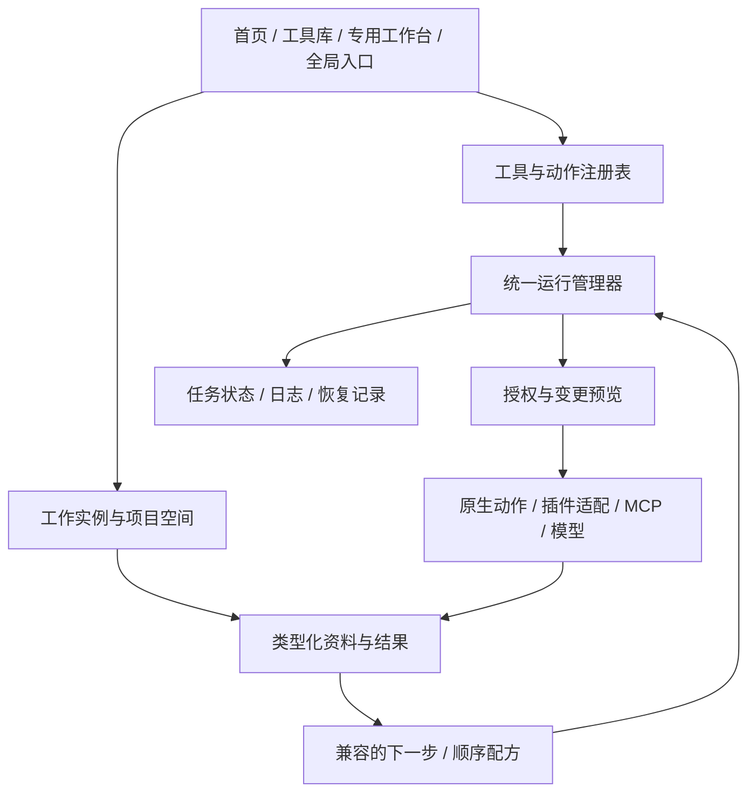

# Zi DevTools 整体架构、导航与工具协作评审

日期：2026-10-02。代码基线：`7114d48`，版本号 `0.77.0`，包含尚未发布的 Stage 78 工作。本文是评审与建议方案，不表示下述能力已经实现。

## 结论与产品原则

现有工具已经有实用基础，但继续逐项增加页面，会让“找到工具、准备输入、接续处理、找回结果”越来越费力。下一轮应优先完善承载工具的平台，再扩大工具数量。

产品目标：让用户在本机方便地完成以前需要访问网站、安装多种软件或反复复制粘贴才能完成的任务。离线处理是优势；用户选择的本地服务和远程服务也是可选能力。

用户本次明确：**没有要求禁止本地保存，也没有要求所有操作只读。用户同意后，可以保存数据、修改文件、操作数据库以及执行其他写入。** 过去的只读与内存限制应视为各工具当前实现范围，而非永久产品要求。现有版本的边界描述仍然保留，不能仅改文案就声称支持写入。

建议形成三个共同原则：

1. 从用户的任务或手头材料开始，工具是完成任务的方式。
2. 处理结果可以继续使用、保存和追溯，不必反复导出再导入。
3. 写入能力通过明确的操作、作用范围、预览和恢复机制开放；普通本地转换不反复弹确认。

## 证据与范围

本次重新编译 `capture_ui`，通过真实 eframe 渲染器生成并逐张查看七张合成数据画面。逻辑视口为 1280×900，输出为 1600×1125；搜索画面为浅色，其余为深色。没有读取用户业务文档或启动生产服务。

这是代码与合成状态画面的结构评审。截图由预览夹具设置状态，并非七步真实点击链。没有完成真实新用户可用性测试、键盘全流程、屏幕阅读器、不同缩放比例或上百工作台性能测试；下文指标都是验收目标。

当前目录有 133 项：87 已实现、9 开发中、37 规划中。截图首页有 89 个内置可见入口（含开发中）；入口、工具能力、工作台页面的统计口径不同，不可混用。`Page` 有 42 个变体，`src/app.rs` 有 4880 行。行数本身不是缺陷，集中耦合才是后续扩展风险。

| 步骤 | 本次查看的状态 | 判断与观察 |
| --- | --- | --- |
| 1 | 首页 `home-dark.png` | 需要优先改进。已有搜索和四种筛选，但目录为五页，单页还需纵向滚动；侧栏首屏看不到后段领域入口。 |
| 2 | 快速搜索 `launcher-light.png` | 基础较好。JSON 精确项在前，有键盘操作提示；结果行缺少用途、输入类型与匹配原因，用户仍需打开试探。 |
| 3 | 最近 `recent-dark.png` | 可用但不足以继续任务。显示最近工具，不显示之前处理的文件、实例和未完成草稿。 |
| 4 | 文件导入 `file-intake-dark.png` | 流程清楚，但主按钮是替换已有草稿。扩展名推荐和有限目标列表不足以覆盖未来图片、文档、数据库等材料。 |
| 5 | 结果接力 `handoff-dark.png` | 已有来源预览与显式替换。目标为通用工具列表，没有基于类型的下一步推荐，也没有新实例选项。 |
| 6 | 本地知识源 `knowledge-sources-dark.png` | 来源、扫描和规则清楚；后续解析、索引、检索藏在其他同级页面，以说明文字指路。 |
| 7 | 任务中心 `tasks-dark.png` | 有取消中、进度和完成状态，但覆盖范围仅为数据解析、合并、文件校验。 |

## 主要发现，按优先级排序

### R1 · 高优先级：导航仍按功能增长，用户需要理解内部模块

证据：步骤 1、6；[侧栏和页面路由](../src/app.rs)、[知识功能现状](platform-roadmap.md)。42 个页面变体通过大量侧栏按钮和集中分支连接；知识源、解析、索引、向量、关键词、混合检索、问答、评测等各占入口。原路线已经提出稳定侧栏，但实际代码继续追加了按钮。

影响：领域入口被挤出首屏；用户为了“拿文档回答一个问题”，必须先理解模块关系。工具和工作台各达数百时，分类只能缓解浏览，不能代替任务导航。

建议：稳定应用外壳，按领域组织工作台；把高级功能保留为可直接搜索的动作，不强迫所有人逐页操作。知识库默认提供“添加资料 → 准备检索 → 搜索/问答”，索引与向量设置进入高级配置。

### R2 · 高优先级：搜索能找工具名，还不能可靠地找任务、文件和操作

证据：步骤 2、3；`ToolEntry::score` 在 [app.rs](../src/app.rs) 中使用空白分词后逐词子串匹配；收藏、最近和次数提供辅助权重。[preferences.rs](../src/preferences.rs) 的最近只保留 20 个工具 ID。

影响：熟悉 JSON 等名称时很好用；不知道名称、使用中文口语或想继续上次处理的文件时，帮助有限。无空格中文整句也必须作为完整子串出现，不能视为语义检索。

建议：统一搜索工具、动作、已授权保存的实例和工作流；先实现本地别名、中文用途词、拼音/首字母、容错和结构过滤。结果说明“可以做什么、接收什么、为何匹配”。AI 意图解析为可选增强，不成为基础搜索依赖。

### R3 · 高优先级：结果接力是文本搬运，尚未形成通用数据接口

证据：步骤 4、5；[handoff.rs](../src/app/handoff.rs) 的 `Transfer` 是最多 2 MiB 的 `String`，`Target` 手工枚举轻量工具、CSV/TSV/JSON 表和文本对比；[intake.rs](../src/intake.rs) 有单独的 11 个导入目标。HTTP 接力目前传的是含状态和响应头的完整文字，而非独立响应正文对象。

影响：图片、文件集合、数据库查询结果、引用文档和插件输出很难互用；能“接收文本”不等于能正确处理该内容。来源和转换关系也不能完整保留。

建议：引入统一的结果对象与动作输入/输出声明，按兼容性推荐下一步。区分 HTTP 正文与完整响应；不能把任意文字默认为 JSON。先连通三条高价值链，再建设复杂工作流。

### R4 · 高优先级：工具、实例、数据保存的概念没有统一

证据：步骤 3–5；[DevToolsApp](../src/app.rs) 为多数工作台持有一份状态；[ToolState](../src/tools.rs) 已有按工具类型保留的草稿，但不是同一工具的多实例。导入和接力明确替换目标输入。

影响：同时处理两份 CSV、两张图或两组诊断材料时，缺少通用的命名会话、返回路径和恢复机制。用户不能仅靠“最近工具”继续原任务。

建议：区分工具定义、工作台模板、工作实例和项目空间。复杂任务可“新建实例、替换当前、追加（若支持）”；已有未保存内容时以新实例为默认。轻量一次性转换保持直接，不强制建项目。

### R5 · 高优先级：生命周期与后台任务管理不一致

证据：步骤 7；[task_center.rs](../src/app/task_center.rs) 仅观察三类工作；[tasks.rs](../src/tasks.rs) 是内存状态历史。MCP 等在应用级更新；[agent_ui.rs](../src/agent_ui.rs)、[image_tools.rs](../src/image_tools.rs)、[knowledge_answer.rs](../src/knowledge_answer.rs) 的部分结果接收在页面 `ui()` 中。

影响：不能据此断言离开页面会停止后台计算，但可确认结果收取和状态展示路径不统一。随着并发工具增多，关闭页面、后台取消、完成通知和退出恢复难以一致。

建议：统一运行管理器负责 `RunId`、状态事件、进度、取消、资源限额和输出；页面只订阅。任务中心能直达对应实例和产物。待执行、等待批准、执行中、正在提交、完成、部分完成、失败、取消须明确区分。

### R6 · 中高优先级：目录、路由和插件协议缺少同一份能力描述

证据：[tools.json](tools.json) 是文档状态源，运行时另在 `catalog()`、`tool_category()`、`open_entry()`、`Page` 和插件适配器中描述入口；[sync_tools.py](../scripts/sync_tools.py) 用源码正则核对 ID，未验证动作类型或真正可调用契约。[plugins.rs](../src/plugins.rs) V1 为 Builtin/HTTP 两类适配器。

具体不一致：步骤 2 的“MCP 客户端配置导出”被归到“文本与编码”，对应 `tool_category()` 未覆盖的 ID 落入默认分类。分类漏项会随着手工分支扩大。

建议：统一版本化工具描述；成熟度、领域、用途、输入输出、能力、路由与提供者明确分字段。保留现有稳定 ID。内置工具、声明式插件、未来进程插件和 MCP 适配器都向注册表提供描述；文档和运行时通过结构化校验对齐，逐步替代源码正则。

### R7 · 中优先级：持久化与写入能力分散，缺少统一的用户选择

证据：[会话库](../src/chat_library.rs) 已支持保存与删除，知识索引已写入本地 SQLite，图片可另存，设置和凭据已有持久化。因此产品并非完全不落盘。另一方面，SQLite 浏览器、目录对比与重复文件工具当前只读，Agent 也限制只读调用。

建议：把“保存什么”和“允许改什么”分开设置。提供临时使用、保存到项目空间、输出到用户目录三种选择，配合可管理的保留时间、配额和清理。无需为每次低影响转换弹权限窗口；修改原文件、批量删除和对外提交时提供具体变更预览。

### R8 · 中优先级：视觉层级统一，但信息密度与反馈还有空间

证据：七张新截图。首页大卡片适合发现少量工具，面对 89 个入口已出现分页和页内滚动叠加；空的最近页仍占据完整目录布局。知识源页的内部实现说明较多，任务中心失败项需跳回工具才能看细节。

建议：首页保留精选卡片，工具库提供紧凑列表；弱化“内置/插件”，突出用途和所需输入。说明分成简短主提示与展开详情。失败项直接显示原因和可做的下一步，完整诊断可展开。统一输入、运行、输出、继续处理、保存的位置。

可见的无障碍风险：多处辅助说明字号较小，收藏及左下角主要依靠图标表达；需验证文本缩放、可访问名称、焦点可见性和键盘顺序。当前截图不能证明对比度达标、完整键盘可用或屏幕阅读器兼容。

## 面向数百工具和工作台的信息架构

应用侧栏建议保留六个主入口：**开始、工具库、我的空间、资料与结果、任务、扩展**。设置固定底部。允许用户固定少量常用工作台，但不随安装数量无限增长。

| 区域 | 默认内容 | 如何应对增长 |
| --- | --- | --- |
| 开始 | 继续最近任务、固定常用、拖入/粘贴材料 | 首屏不排列所有工具；首次使用给少量场景入口。 |
| 工具库 | 搜索、领域、用途标签、可用状态，紧凑列表为主 | 文本/数据、文件、图像影音、开发诊断、网络、知识、AI 等只是筛选维度；允许交叉标签。 |
| 我的空间 | 用户的项目和命名工作实例 | 例如“博客素材”“Java 项目排障”“每月账单”；可收藏、归档、搜索和恢复。 |
| 资料与结果 | 用户保存的输入、结果、引用与版本 | 查看来源和后续处理关系；支持“用其他工具继续”。无需强制复制全部原文件。 |
| 任务 | 运行、待批准、已完成、失败 | 按项目/工具筛选，返回准确实例；从这里管理并发与取消。 |
| 扩展 | 已安装插件、连接器、服务、更新与健康状态 | 普通用户使用统一工具入口，管理时才区分提供者。 |

工作台可以有上百个模板与实例，但无需有上百个顶层菜单。领域聚合与全局搜索解决“找哪一个”，命名实例和空间解决“回到哪一次”。领域内的专用界面继续保留，不把所有工具强行做成同一种表单。

全局入口沿用现有快捷键。默认 Enter 打开；只有用户明确选择“执行动作”才运行，避免按一次 Enter 就修改文件。粘贴和拖入后展示可用动作及推荐原因；剪贴板只在用户调用时读取，不默认后台监听。

搜索排序建议：精确名称/动作 > 输入类型兼容与用途匹配 > 项目上下文 > 收藏/近期/频次。收藏不应把无关工具推到相关结果之前。规划中条目默认不混入可运行结果；缺少依赖的工具显示原因与设置入口。文件内容搜索仅覆盖用户加入的资料范围。

## 工具互通：先共享结果，再形成配方

建议采用以下结构，名称为设计草案，不是现有 API：

| 对象 | 职责 |
| --- | --- |
| `ToolDescriptor / ActionDescriptor` | 稳定 ID、版本、领域、别名、可用性、输入输出类型、参数、所需能力及是否支持预览/取消。 |
| `WorkbenchTemplate / Instance` | 专用界面模板与一次具体工作；同一工具可以有多个实例。 |
| `Workspace` | 命名项目、输入引用、实例、配方、保存与授权偏好；不等于获得整个磁盘访问权。 |
| `Artifact` | 有类型和版本的输入或结果：文本、JSON、表格、图片、文件集合、文档、报告等。 |
| `Run` | 某动作针对某输入版本的一次执行，记录状态、参数、产物与失败原因。 |
| `Grant / ChangeSet` | 用户允许的行为范围，以及一次提交前可审阅的具体变更集合。 |

结果对象包含 ID、逻辑类型/MIME、结构、大小、来源和生成操作。大文件用文件引用、对象存储或流，不塞进 UI 字符串；表格保留列类型，文档保留来源和定位。路径引用必须能识别外部变更与丢失；不能只记一个路径就认为内容始终不变。

转换显式进行：JSON 数组可转表格，但必须检查列结构；表格可导 CSV，但提示类型损失；图片可交给编码器；OCR 尚未实现时只列规划。二进制文件不隐式转 Base64，报告元数据也不隐式当正文。导出到远程模型前展示内容范围和目标；权限不会因为数据“来自别的工具”而自动继承。

优先打通三条本机链：

1. JSON 结果 → 数据表 → 选择列/清洗 → CSV 或新 SQLite 表。前半段已有基础，写入 SQLite 为新增能力。
2. 图片 → 裁剪/缩放 → 编码预览 → WebP 批量输出 → 文件校验清单。每步可查看产物与实际大小；保存步骤一次确认目标及冲突策略。
3. 目录对比/重复检测 → 选择差异 → 预览复制、移动或回收站计划 → 执行 → 报告/可恢复记录。后半段是新增写操作。

知识任务可随后整合为：文档收集 → 解析/索引 → 检索/问答 → 引用笔记。已有模块通过共同任务界面编排，避免要求用户逐页寻找。

第一版“配方”使用顺序步骤列表，每步有输入、参数、输出预览，支持保存和再次运行。以后再扩展分支和可视化连线；先实现数据契约、取消和权限，再做画布。重试只自动用于声明幂等且经过验证的动作；具有写入副作用的步骤不能因超时就自动重放。

## 保存数据与开放写入的设计

“是否持久保存”与“是否允许修改外部资源”是两条独立选择。本地保存不等于云同步；远程发送也不应因为批准本地保存而自动获得许可。

| 场景 | 建议交互 | 恢复与边界 |
| --- | --- | --- |
| 临时粘贴与轻量转换 | 直接运行；可选保存为任务 | 临时模式不保存正文，明确关闭后行为。 |
| 用户选择的项目空间 | 开启后自动保存草稿和结果版本 | 可关闭、导出、删除；显示位置、占用与保留策略。 |
| 另存文件、批量输出 | 选择目标、预览数量/大小/冲突；可记住该配方的输出目录 | 原子提交适用时使用；失败显示已完成与未完成清单。 |
| 修改原文件、批量改名、目录同步 | 差异预览、排除项、冲突处理、确认提交 | 提交前重新检查源版本；备份/回收站/操作日志，能够恢复才显示“可撤销”。 |
| SQLite 写入 | 选择写模式、预览目标表/列/行数、显式提交 | 事务回滚、提交后校验；备份策略单独显示。任意 SQL 的可靠预览不能视为已解决。 |
| 插件、Agent、外部命令 | 展示实际操作、路径/地址、权限期限；可按工作流授权 | 每步走共同权限入口，范围或定义变化重新审批；未知执行效果按未知显示。 |

授权可分本次、当前会话、选定工作流或项目中的指定目录/数据库/服务。用户可查看和撤销。没有必要让用户每次批准已经授权范围内的只读与普通转换；永久删除、扩大目录范围或新的外发目标仍需明显提示。取消是停止后续工作，不承诺撤销已经提交的修改。

Agent 应采用“生成计划 → 具体变更预览 → 批准 → 执行 → 校验”。允许预先授权有边界的低影响批处理，但批准文字目标不等于批准未知文件改动。来自文档、工具或模型的内容不能扩大授权。

原生动作可通过受控文件/数据库 API 强制执行范围；任意外部程序拥有操作系统授予的权限。进程分离和清单声明本身不是沙箱，未经操作系统级验证不能承诺限制其全部磁盘或网络行为。

存储建议采用 SQLite 管理实例、运行元数据和引用；大产物放独立文件区，保留已有文档/向量索引，避免一次迁移全部存储。凭据继续使用系统凭据库。持久历史中的正文、URL 和路径也可能敏感，应提供内容保留选择。

磁盘管理区分别列出原文件引用、用户保存结果、草稿版本、派生索引与可重建缓存。仅对可重建缓存设置默认自动清理；用户产物、固定版本和原文件不随缓存回收。配额、保留期限、清理预览和大文件去重必须随持久化一起设计，避免方便保存变成不可见的空间消耗。

## 渐进架构调整

保留 Rust/eframe 和现有工具实现，不建议为了这个问题换技术栈或一次性重写。先从 `app.rs` 提取注册表、导航、实例管理和任务服务；已有处理函数通过适配层接入。默认实例保持现有行为和稳定工具 ID，老收藏、偏好、插件 v1 与知识数据继续可读。

内置动作、插件和 Agent 共享调用入口，不能出现“GUI 有预览，Agent 绕过预览”的第二条写路径。提供统一事件与有界队列，繁重处理在后台；视图按需创建，长目录虚拟化/分页，搜索索引增量更新。不要为每个工具预先打开文件、连接服务或启动独立常驻线程。

迁移按切片推进：先选 JSON/数据、图片、文件三类适配，验证后扩大。新旧执行器短期共存时明确标记哪些支持统一任务/接力，不能把部分覆盖展示为全平台完成。保存格式需要版本号、旧格式读取和失败保护；迁移失败保留原文件。

## 建议实施顺序与验收

| 轮次 | 交付 | 验收重点 |
| --- | --- | --- |
| A：可发现性 | 提取注册表；稳定六个主入口；首页继续任务；工具库紧凑视图；搜索别名/分类修正 | 保留所有现有入口与收藏；300 工具、100 工作台模板测试目录下无导航丢失；明确开发中状态。 |
| B：实例与任务 | 命名实例、项目保存选项；统一运行管理器先覆盖数据/图片/文件，再纳入其他工具 | 同工具可同时保留两份工作；切页、隐藏、关闭视图后状态一致；终态可找回准确结果；取消不误报成功。 |
| C：结果与配方 | 类型化结果、兼容动作推荐；新建实例/追加/替换；三条示例链及顺序配方 | 类型不匹配提前解释；原结果保留；工作流输入可更换；失败定位、版本与引用可追溯。 |
| D：可授权写入 | 通用 ChangeSet/授权；先做另存、批量改名或复制，再做回收站与 SQLite 写入 | 无授权不写、源变化拒绝旧预览、冲突可处理、部分失败可解释；恢复能力逐项验证。 |
| E：扩展执行 | 插件能力声明、进程协议、Agent 写步骤；后续工作流分支与恢复 | 权限变更复核、进程退出、限额、撤销、无副作用自动重试；不宣称未经验证的沙箱。 |

以下是建议指标，当前没有测量结果：

- 建立至少 30 条常见用途查询（含中文口语、别名、拼写误差和中英混合），预期工具 Top 3 命中率达到 90% 以上；增加无结果与缺失依赖用例。
- 常用入口两次操作以内到达；同一任务恢复两次操作以内；从已有产物选择下一步不再要求手工复制粘贴。记录具体点击/按键口径。
- 在记录 CPU、内存、屏幕缩放和数据规模的 Windows 基准机上，预热后本地搜索显示结果 P95 目标小于 100 ms；冷启动、空闲资源、滚动和多任务响应另行建立基线。不能仅凭工具数量断言卡顿。
- 300 工具、100 模板和 1000 个保存实例分别压测；目录元数据数量不等于打开全部重型任务。
- 对键盘操作、125%/150%/200% 缩放、窄窗口、深浅主题、屏幕阅读器做专项验证；截图通过不代替交互验证。
- 写操作覆盖预览后外部修改、符号链接/路径变化、磁盘满、文件占用、崩溃、部分完成、撤销冲突；恢复失败明确显示，不能默默覆盖后来修改。

这些建议与 [平台路线](platform-roadmap.md)、[工具清单](tools.md) 中已有的 pipeline/workflow-builder/plugin-sdk 等规划关联。本次不把建议标为 implemented，也不变更发布版本；拆分进入具体开发轮次时再更新唯一清单与验收范围。
