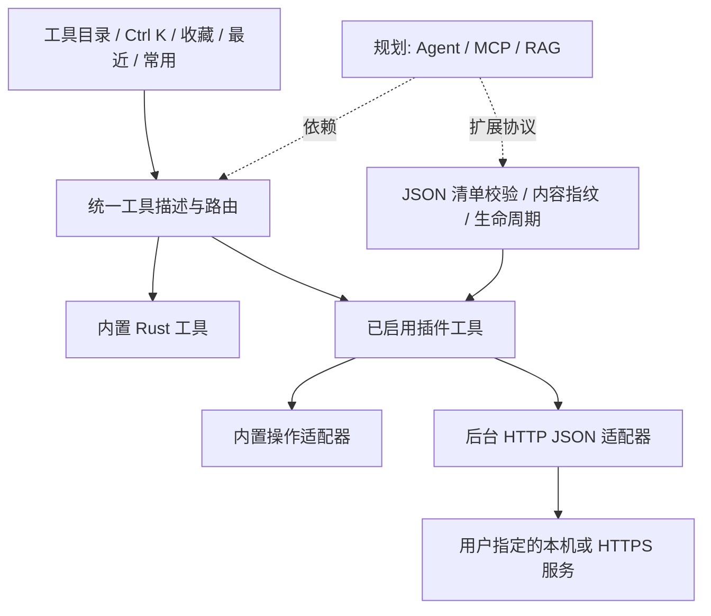

# 从工具箱到可扩展的本地工作台

更新：2026-09-26 · v0.22.0 开发中（公开版 v0.21.0）。工具唯一状态源为 [tools.json](tools.json)，当前 117 项目录条目：55 项内置已实现、62 项规划；另有 3 个可选示例插件包，共 6 个插件工具。连接器需要用户已有服务和模型，不能把插件数量当作已安装模型数量。

## 本轮已落地

- 十类目录：数据与格式、文本与编码、网络与接口、文件与系统、时间与生成、AI 与模型、知识与检索、扩展与集成、Java 与 JVM、Python 与 Django。
- 全部、收藏、最近、常用四个视图。最近保留 20 项，常用按打开次数排序；仅记录工具 ID 和次数，不记录输入。
- 统一搜索覆盖 ID、名称、描述、分类和关键词；多个关键词同时匹配。精确名称优先，收藏/最近/频次作为辅助权重。
- 应用内 Ctrl K 支持上下键、Enter、Esc；内置与已启用插件使用同一个目录。停用/卸载后不再出现在可用搜索结果中。
- 插件中心支持 JSON 清单预览、安装、启用、停用、刷新和确认卸载；已启用内容绑定 SHA-256，清单变更后需重新启用。
- 适配器 V1：复用内置处理操作，以及限定 GET/POST 的非流式 JSON HTTP 请求。所有请求由用户点击触发。
- 官方示例：本地文本配方（保持顺序去重、提取名称）、Ollama（模型列表、单轮问答）、OpenAI 兼容服务（模型列表、单轮问答）。
- 本机集成发现只检查 PATH 中的软件入口和少量常见本地端口；不存在自动读取其他软件文档、对话和凭据的行为。

## 架构与扩展边界

UI、服务管理、插件校验与适配器继续使用 Rust，保持 Windows 应用独立运行。插件为数据清单，不执行安装脚本或加载动态库。Python/Node/Docker 不是核心应用依赖。V1 的网络地址在安装预览、管理页和运行页展示；Bearer 令牌默认临时保留；Stage 22 开发版增加显式 Windows 凭据存储，不保存在清单或偏好文件。HTTP 不跟随重定向，不使用环境代理，远程目标要求 HTTPS。

接口请求总超时 30 秒、响应最多 2 MiB，任务在后台线程运行；当前只支持非流式 JSON。尚未实现手动取消正在进行的网络请求，因此运行中禁用停用/卸载，任务可自然结束或超时。内容指纹表示本地批准内容一致，不等于作者身份认证或数字签名。

后续隔离进程插件必须单独设计协议与系统资源控制；不能把“子进程”直接宣传成沙箱。声明式插件同样可能将用户输入发送到声明的地址，应按目标和来源选择启用。

## 本机软件复用调查

本轮只读调查记录（不是永久可用性承诺）：

| 软件 | 本次证据 | 复用方式 | 当前边界 |
| --- | --- | --- | --- |
| Ollama | CLI 0.6.6；提示未连接运行实例，11434 无监听 | 官方本地 API，提供可选插件示例 | 未启动服务、未下载模型、未验证实际推理 |
| AnythingLLM | 注册表发现 1.7.4 安装记录 | 通过官方 API 对接选定知识工作区 | 安装记录不证明当前运行；未读私有数据库 |
| Codex CLI | `codex-cli 0.157.1` | 未来使用独立任务目录与结构化 CLI 事件 | 未复用登录令牌/会话历史，尚未执行 Agent 任务 |
| Docker | CLI 28.5.1 | 可选部署向量库/模型服务，提供状态面板 | 未确认 Docker daemon，未创建容器 |
| Python / Node.js / uv | 3.14.7 / 26.10.0 / 0.8.0 | 未来隔离进程插件与 MCP stdio 运行时 | 不作为核心依赖，插件应逐项检测兼容性 |
| Cursor / VS Code | 注册表存在安装条目 | 未来打开工作区、导航到文件或导出 MCP 配置 | 不把编辑器内部数据库当作公共集成接口 |
| LM Studio / Qdrant | 本次常见端口未连通，未确认安装 | OpenAI 兼容接口 / 可选向量检索服务 | 示例连接器不代表软件已安装 |

先复用软件的公开 API/CLI，再考虑文件级只读导入；不直接耦合它们的私有数据库或内部目录。安装版本、协议版本和运行状态必须在实际接入时重新检测。

## 分阶段路线与验收

| 阶段 | 主线 | 可验收结果 | 前置条件 |
| --- | --- | --- | --- |
| A · 已完成 | 目录与声明式插件 | 安装后搜索可见；停用后消失；本地配方与 HTTP 夹具执行通过 | v0.16.0 |
| B · 下一优先 | 模型连接与插件设置 | 连接档案、系统凭据存储、多轮/流式/取消、提示词模板 | 不把密钥写入 JSON |
| C | MCP 工作台 | stdio/Streamable HTTP 初始化、会话、能力发现、工具参数表单、取消/退出 | 协议兼容测试、权限模型 |
| D | RAG 本地知识库 | 选定目录→解析分块→增量索引→混合检索→带来源引用的问答 | 文档解析器、索引迁移与评测集 |
| E | Agent 任务 | 计划/调用/审批/暂停/取消状态机、步数和费用预算、可靠运行记录 | 稳定模型和 MCP/本地工具契约 |
| F | 插件生态 | 隔离进程 SDK、版本协商、签名/摘要、升级回滚、权限差异 | 生命周期和资源控制验证 |

阶段不是承诺日期；[完整工具清单](tools.md) 中每项均有验收范围。Agent 不会先于工具权限和取消机制开放自主写入；RAG 不会只靠向量检索就声称答案可靠，必须验证来源引用与证据不足行为。

## 工具多起来后的访问设计

首页是统一目录，而不是持续增加侧栏按钮。侧栏保留稳定工作区入口；新增插件不向侧栏追加无穷菜单。分类用于缩小范围，标签和关键词用于交叉场景，收藏用于固定个人常用项，最近用于继续当前工作，常用用于发现重复任务。

Ctrl K 用于应用窗口内搜索；Stage 20 已增加可配置的系统全局热键，默认 Ctrl+Alt+Space 打开独立快捷面板。工作区工具集合、拖拽排序、剪贴板上下文动作仍列入规划。未来复杂工作台通过同一工具 ID 打开，不单独维护一份搜索索引。停用工具的收藏 ID 可保留，重新启用后恢复可见；卸载不会静默影响其他插件。

## 维护规则

新增工具先写清用途、分类、依赖、输入/输出、权限、错误与取消行为，再选择内置或插件实现。只有可用入口和验证证据齐备才标 implemented。更新 tools.json 后生成 README/tools.md，发版同步官网快照。示例插件与运行时协议必须一同维护；模型推理、MCP 和 RAG 以真实端到端证据描述成熟度。

## Java / Django 专项

Stage 17 加入离线异常结构整理、目录分页与后台结果反馈。Stage 18 已实现 14 项环境/性能/迁移诊断首版，输入、依赖与验收边界见 [Java 与 Django 工具路线](java-django-roadmap.md)。

## Stage 20 进展与下一步

已完成全局启动器、独立托盘面板和文件导入。接下来依次推进工具结果接力、数据列转换/CSV 关联、任务中心，再完善插件设置/版本更新并建设 MCP 调试工作台。Agent/RAG 仍按清单规划实施，不宣称已完成。SQLite 浏览器与工作台规划合并为 sqlite。

Stage 21 进行中：统一结果互传已接入，包含来源快照、目标搜索和显式覆盖；可组合管线尚未实现。后续继续推进数据列转换/CSV 关联与任务中心。

Stage 21 第二轮：列转换已加入去空白、Unicode 大小写、空值处理、列名修改及单步撤销；作用范围为整列，保留原始输入。待完成 CSV 关联与任务中心。

Stage 21 第三轮：列选择及文本/整数/数字/布尔转换完成，数据列变换提供独立目录入口。小数使用浮点表示；整数采用 64 位有符号/无符号边界检查。后续继续 CSV 关联和任务中心。

Stage 21 第四轮：CSV/TSV/JSON 内连接、左连接、同名列追加和等行数拼列完成；后台可取消预览与重复键展开/冲突统计，应用保留单步撤销。仍待统一任务中心。

Stage 21 第五轮：后台任务中心接入数据解析、合并和文件校验，跨页面收取结果，内存最近 50 条记录、运行中优先、取消确认和打开工具。尚未接入 HTTP/插件/Java/Django 的任务记录。本地整体验收通过；公开状态以 GitHub Release 为准。

Stage 22 已发布：插件凭据系统存储和工具级地址/模型设置首版完成，新增可复用命名连接档案，新增 OpenAI/Ollama 模型列表发现与连接检查，通用设置 schema 待续。保存凭据按工具标识、方法、精确 URL 隔离，不读取其他应用的凭据。

Stage 23 已发布：已接入受支持文本模板的多轮上下文、失败重试、流式输出与客户端取消；成功会话支持 Markdown/JSON 导出和 JSON 预览确认恢复；UTF-8 文本附件支持明确选择、预览快照并合入用户消息。

Stage 24 开发中：当前多轮会话仍默认仅在内存；用户可以主动保存命名会话到本地库，并在列表中预览、确认恢复或删除。不会保存连接凭据、未发送输入，也不会自动请求或恢复。

待完成：模型工作台整体布局与交互验收、真实模型兼容性验证、PDF/Word/图片解析、自动恢复/多会话切换策略和 token 预算。模型对话工具仍标记为开发中。
