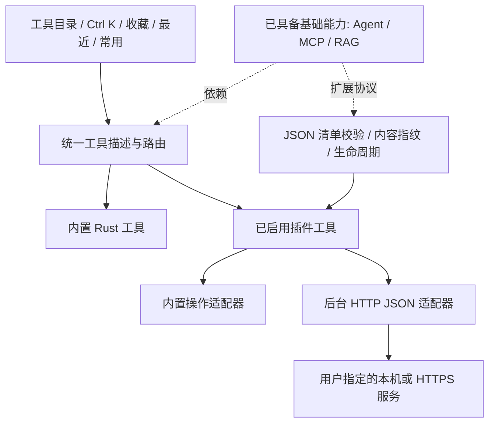

# 从工具箱到可扩展的本地工作台

## 2026-10-02 整体评审与下一轮方向

[架构、导航与工具协作评审](architecture-review-2026-10.md) 基于当前源码和新生成的七组界面状态，提出稳定导航、统一工具注册、工作实例、类型化结果互传、后台任务与用户授权写入的渐进方案。建议先改善大量工具的访问和协作，再继续扩大工具数量；具体轮次与验收目标见评审。以下历史阶段边界继续描述现有实现，不代表产品永久限制。

用户明确允许在同意后本地保存及修改数据。因此“本地优先”允许可选草稿恢复、结果保存、批量文件操作、数据库写入和 Agent 写步骤；必须同时设计范围授权、变更预览、冲突处理与适用的恢复机制。尚未实现的写入能力仍为规划，不提前更改工具状态。

<!-- catalog-summary:start -->
更新：2026-10-08 · 工具目录版本：v0.82.0-dev.71。工具唯一状态源为 [tools.json](tools.json)，当前 152 项目录条目：90 项已实现、62 项规划或开发中；另有可选示例插件包。连接器需要用户已有服务和模型，不能把插件数量当作已安装模型数量。
<!-- catalog-summary:end -->

## 桌面效率扩展（2026-10-05）

九项新增需求与验收见 [桌面效率扩展](desktop-product-roadmap.md)，独立版本规则见 [工具版本](tool-versions.md)。统一命令、前缀快捷键、右键入口和工具互通共用基础；录屏教程合成、透明套索截图、计算器、时钟、更新和超级剪贴板分阶段推进。除版本基础外，新增能力仍标为规划。

## 本轮已落地

Stage 80 已正式发布：结果接力提供同源别名/分类/用途搜索及有界 JSON 推荐；选择后明确应用，可创建新数据实例或备忘/日程草稿，来源保留。日程底部可往返视图与编辑，保持未保存内容。开发版已支持可另存/读取的表格流程，包含列清洗、选列、筛选、排序和去重，见[操作流程](workflows.md)。通用跨工具配方、跨工具项目空间和授权写入继续规划。

Stage 78 已调整侧栏紧凑布局：当前工具 / 返回 / 同类工具与主题 / 托盘 / 设置固定，中间主导航和收藏独立滚动，并增加常用排行快捷入口。适配支持的最小窗口，不增加工具数量。

新增[备忘录、万年历与日程](planner.md)：统一搜索/收藏/托盘入口；主动本地保存、回收站恢复与备忘转日程。提醒在主窗口隐藏或最小化时仍运行，退出后重启补显示。公历月 / 年重复、缺日处理、截止日期与基础 ICS 文件互通已接入；v0.79.0-dev.10 已补按星期排列的周视图、跨天覆盖和原系列直达；后续补农历重复、ICS 时区 / 次数 / 例外扩展和系统通知；不把本轮实现扩张为后台常驻系统服务。

Stage 78 已开始落实评审 A 轮：[导航与搜索说明](navigation.md)。主侧栏固定为开始、工具库、后台任务、扩展与连接器，辅以最多六个收藏入口；工具目录改用连续列表，名称/用途/分类/别名统一来自 tools.json 的 discovery，Rust 保留可执行路由。开始页保留最近工具，并新增本次数据实例返回及已保存实例入口；数据/清洗/合并已接入命名多实例和主动保存/恢复，见[工作实例说明](work-instances.md)。跨工具项目空间、类型化结果、统一运行与授权写入继续列为 P1。

- 十一类目录：数据与格式、文本与编码、网络与接口、文件与系统、时间与生成、AI 与模型、知识与检索、扩展与集成、MCP 与 Agent、Java 与 JVM、Python 与 Django。
- 全部、收藏、最近、常用四个视图。最近保留 20 项，常用按打开次数排序；仅记录工具 ID 和次数，不记录输入。
- 统一搜索覆盖 ID、名称、描述、分类和关键词；多个关键词同时匹配。精确名称优先，收藏/最近/频次作为辅助权重。
- 应用内 Ctrl K 支持上下键、Enter、Esc；内置与已启用插件使用同一个目录。停用/卸载后不再出现在可用搜索结果中。
- 插件中心支持 JSON 清单预览、安装、启用、停用、刷新和确认卸载；已启用内容绑定 SHA-256，清单变更后需重新启用。
- 适配器 V1：复用内置处理操作，以及限定 GET/POST 的非流式 JSON HTTP 请求。所有请求由用户点击触发。
- 官方示例：本地文本配方（保持顺序去重、提取名称）、Ollama（模型列表、单轮问答）、OpenAI 兼容服务（模型列表、单轮问答）。
- 本机集成发现只检查 PATH 中的软件入口和少量常见本地端口；不存在自动读取其他软件文档、对话和凭据的行为。

## 架构与扩展边界

UI、服务管理、插件校验与适配器继续使用 Rust，保持 Windows 应用独立运行。插件为数据清单，不执行安装脚本或加载动态库。Python/Node/Docker 不是核心应用依赖。网络地址在安装预览、管理页和运行页展示；Bearer 令牌默认临时保留；Stage 22 增加显式 Windows 凭据存储，不保存在清单或偏好文件。HTTP 不跟随重定向，不使用环境代理，远程目标要求 HTTPS。

通用插件 HTTP JSON 请求总超时 30 秒、响应最多 2 MiB，任务在后台线程运行；这类请求尚未实现手动取消，因此运行中禁用停用/卸载，任务可自然结束或超时。受支持的 OpenAI/Ollama 文本模板另支持 SSE/NDJSON 流式与客户端停止，边界见插件说明。内容指纹表示本地批准内容一致，不等于作者身份认证或数字签名。

后续隔离进程插件必须单独设计协议与系统资源控制；不能把“子进程”直接宣传成沙箱。声明式插件同样可能将用户输入发送到声明的地址，应按目标和来源选择启用。

## 本机软件复用调查

本轮只读调查记录（不是永久可用性承诺）：

| 软件 | 本次证据 | 复用方式 | 当前边界 |
| --- | --- | --- | --- |
| Ollama | Stage 58 验证本机 0.6.6 正在监听 `127.0.0.1:11434`；Stage 59 用 `bge-m3:latest` 对两份合成文档实际建立 1024 维向量索引，Stage 60 验证混合检索，Stage 61 验证混合证据进入 `qwen2.5:7b` 问答 | 官方本地 `/api/embed`，已接入 Embedding 工作台、可选向量索引与混合证据问答；另有可选插件示例 | 本机当时的验证，不保证其他设备或未来始终运行；证据有效仍不证明答案事实正确 |
| AnythingLLM | 注册表发现 1.7.4 安装记录 | 通过官方 API 对接选定知识工作区 | 安装记录不证明当前运行；未读私有数据库 |
| Codex CLI | `codex-cli 0.157.1` | 未来使用独立任务目录与结构化 CLI 事件 | 未复用登录令牌/会话历史，尚未执行 Agent 任务 |
| Docker | CLI 28.5.1 | 可选部署向量库/模型服务，提供状态面板 | 未确认 Docker daemon，未创建容器 |
| Python / Node.js / uv | 3.14.7 / 26.10.0 / 0.8.0 | 未来隔离进程插件与 MCP stdio 运行时 | 不作为核心依赖，插件应逐项检测兼容性 |
| Cursor / VS Code | 注册表存在安装条目 | 未来打开工作区、导航到文件或导出 MCP 配置 | 不把编辑器内部数据库当作公共集成接口 |
| LM Studio / Qdrant | 本次常见端口未连通，未确认安装 | OpenAI 兼容接口 / 可选向量检索服务 | 示例连接器不代表软件已安装 |

先复用软件的公开 API/CLI，再考虑文件级只读导入；不直接耦合它们的私有数据库或内部目录。安装版本、协议版本和运行状态必须在实际接入时重新检测。

## 分阶段路线与验收

| 阶段 | 主线 | 可验收结果 | 前置条件 |
| --- | --- | --- | --- |
| A · 已完成 | 目录与声明式插件 | 安装后搜索可见；停用后消失；本地配方与 HTTP 夹具执行通过 | v0.16.0 |
| B · 部分完成 | 模型连接与插件设置 | 连接档案、系统凭据存储、多轮/流式/取消、提示词模板 | 不把密钥写入 JSON |
| C · 部分完成 | MCP 工作台 | 已有本机 stdio 短会话/持续连接、有界 Streamable HTTP 调试和只读知识库 MCP 服务；按服务和工具定义绑定的只读直接调用规则已接入本机 Agent。HTTP 认证及实验性 OAuth 见专项说明 | 更广第三方协议兼容、跨客户端权限模型、长期会话恢复 |
| D · 部分完成 | RAG 本地知识库 | 已有目录扫描、解析、增量全文索引、关键词检索、可选本机向量索引、语义与混合检索、可选混合证据的带引用问答，以及固定样例的关键词/混合同题对照和引用评测 | 模型/索引迁移、更丰富评测集与事实忠实度核验 |
| E · 部分完成 | Agent 任务 | 本机 Ollama + 已直接授权的只读 MCP 工具具备计划、人工批准、白名单、步数/字节上限、取消、显式 JSON 导出、只读导入与目录检索；写操作、暂停恢复、费用预算与可靠持久执行待实现 | 稳定模型和 MCP/本地工具契约 |
| F | 插件生态 | 隔离进程 SDK、版本协商、签名/摘要、升级回滚、权限差异 | 生命周期和资源控制验证 |

阶段不是承诺日期；[完整工具清单](tools.md) 中每项均有验收范围。Agent 不会先于工具权限和取消机制开放自主写入；RAG 不会只靠向量检索就声称答案可靠，必须验证来源引用与证据不足行为。

## 工具多起来后的访问设计

Stage 78 已将开始页与统一工具库分开，侧栏保留稳定入口，新增工具和插件不再追加主侧栏按钮。分类用于缩小范围，用途与关键词用于交叉场景，收藏用于固定个人常用项，最近用于重新打开访问过的工具，常用用于发现重复任务。数据工作实例已接入主动保存/恢复，其他工具继续规划。

Ctrl K 用于应用窗口内搜索；Stage 20 已增加可配置的系统全局热键，默认 Ctrl+Alt+Space 打开独立快捷面板。工作区工具集合、拖拽排序、剪贴板上下文动作仍列入规划。未来复杂工作台通过同一工具 ID 打开，不单独维护一份搜索索引。停用工具的收藏 ID 可保留，重新启用后恢复可见；卸载不会静默影响其他插件。

## 维护规则

新增工具先写清用途、分类、依赖、输入/输出、权限、错误与取消行为，再选择内置或插件实现。只有可用入口和验证证据齐备才标 implemented。更新 tools.json 后生成 README/tools.md，发版同步官网快照。示例插件与运行时协议必须一同维护；模型推理、MCP 和 RAG 以真实端到端证据描述成熟度。

## Java / Django 专项

Stage 17 加入离线异常结构整理、目录分页与后台结果反馈。Stage 18 已实现 14 项环境/性能/迁移诊断首版，输入、依赖与验收边界见 [Java 与 Django 工具路线](java-django-roadmap.md)。

## 当前进展与早期阶段记录

Stage 54 已加入只读知识库 MCP stdio 服务，Stage 55 增加客户端配置预览与复制，Stage 56 的隔离真实 Codex 会话已成功调用两个知识工具。Stage 57 完成通用 MCP 调试台的行为声明展示与调用前定义复核。Stage 58 完成本机 Embedding 工作台，Stage 59 完成独立可选向量索引与语义检索。Stage 60 已将关键词与向量结果以可解释 RRF 融合并公开发布。Stage 61 将混合候选送入证据预览和带引用问答，真实 `bge-m3:latest` 加 `qwen2.5:7b` 合成文档、公开 CI/Release 和官网验证通过。Stage 62 已公开发布固定样例的同题对照和可选混合证据模型评测，真实本机双模型、公开资产与官网验证通过。当前仍需更丰富的真实语料、事实忠实度核验、其他第三方客户端兼容性、插件版本更新及更广范围的 Agent 任务状态机。下列 Stage 20–26 文字保留当时的阶段过程，不代表当前工具状态；实时实现与规划以 [工具清单](tools.md) 为准。

Stage 63 已公开发布本机 MCP stdio 调试台的持久工具规则，包括默认逐次确认、禁止、受限只读直接调用及调用前撤销复核；本地与公开 CI/Release、官网和资产哈希均验证通过。该阶段当时尚未覆盖 Agent 自动调用；持久 MCP 会话及跨客户端权限仍未覆盖，不能将调试台规则视为通用沙箱。

Stage 64 实现本机 Ollama 只读 Agent 首版：人工审阅并批准计划后，仅调用本次白名单中已获直接许可的低影响 MCP 工具；每次调用仍经过原权限网关。一次性协议夹具与本机 `qwen2.5:7b` 合成资料通过。Stage 65 增加单次运行记录的默认不含内容 JSON 预览与手动保存；Stage 66 实现独立的有界导入和只读回看入口；Stage 67 加入显式目录的跨记录元数据检索；Stage 68 加入基线/候选元数据对比与主动复制摘要。可执行恢复、写操作、费用计费、长期持久执行与其他客户端权限仍在规划。

Stage 69–70 增加 Agent 知识检索来源展示、模型证据装箱与回答引用编号校验；Stage 71 加入只读目录空间分析，Stage 72 加入按大小筛选后计算 SHA-256 的重复文件检查。两项磁盘工具均不自动删除文件，检查上限与部分结果会在界面说明。

Stage 73 加入 ASCII 码表、特殊字符/表情/颜文字精选库及 ASCII Art。Stage 74 已发布两个目录按相对路径的只读内容对比；文件同大小时再计算 SHA-256，部分扫描不把未见到的路径断言为缺失。

Stage 75 已发布只读 SQLite 浏览器：本机数据库的表/视图清单、列结构、有限分页预览和当前页 CSV 导出可用；任意 SQL 与写模式仍在后续规划。

已完成全局启动器、独立托盘面板、文件导入、工具结果接力、数据列转换/CSV 关联、任务中心和 MCP stdio 调试首版。插件设置/版本更新与 Agent/RAG 的扩展能力继续按清单推进，不把规划能力视作已实现。SQLite 浏览器与工作台规划合并为 sqlite。

Stage 21 进行中：统一结果互传已接入，包含来源快照、目标搜索和显式覆盖；可组合管线尚未实现。后续继续推进数据列转换/CSV 关联与任务中心。

Stage 21 第二轮：列转换已加入去空白、Unicode 大小写、空值处理、列名修改及单步撤销；作用范围为整列，保留原始输入。待完成 CSV 关联与任务中心。

Stage 21 第三轮：列选择及文本/整数/数字/布尔转换完成，数据列变换提供独立目录入口。小数使用浮点表示；整数采用 64 位有符号/无符号边界检查。后续继续 CSV 关联和任务中心。

Stage 21 第四轮：CSV/TSV/JSON 内连接、左连接、同名列追加和等行数拼列完成；后台可取消预览与重复键展开/冲突统计，应用保留单步撤销。仍待统一任务中心。

Stage 21 第五轮：后台任务中心接入数据解析、合并和文件校验，跨页面收取结果，内存最近 50 条记录、运行中优先、取消确认和打开工具。尚未接入 HTTP/插件/Java/Django 的任务记录。本地整体验收通过；公开状态以 GitHub Release 为准。

Stage 22 已发布：插件凭据系统存储和工具级地址/模型设置首版完成，新增可复用命名连接档案，新增 OpenAI/Ollama 模型列表发现与连接检查，通用设置 schema 待续。保存凭据按工具标识、方法、精确 URL 隔离，不读取其他应用的凭据。

Stage 23 已发布：已接入受支持文本模板的多轮上下文、失败重试、流式输出与客户端取消；成功会话支持 Markdown/JSON 导出和 JSON 预览确认恢复；UTF-8 文本附件支持明确选择、预览快照并合入用户消息。

Stage 24 已发布：当前多轮会话仍默认仅在内存；用户可以主动保存命名会话到本地库，并在列表中预览、确认恢复或删除。不会保存连接凭据、未发送输入，也不会自动请求或恢复。

Stage 25 已发布：本地提示词模板库支持名称/标签检索、变量展开预览、修订差异与同工具参数快照的明确应用；模板和变量值均不会自动运行。

Stage 76 开发中：MCP stdio 协议调试台可手动启动本机 EXE，初始化并有界枚举工具/资源/提示词，查看 schema、显式调用工具及停止进程。可选择每次短会话或显式持续连接，同一进程多次操作；调用逐次复核身份、工具定义和权限。Streamable HTTP、心跳、跨客户端权限及第三方兼容验收仍在路线 C 中。

Stage 26 当时待完成的 PDF/Word 解析与本机索引已在后续阶段实现。当前仍需真实第三方 MCP/模型兼容性、不同模型的资源预算、更大且多样化的检索对照与事实忠实度评测，以及 Agent 自主任务权限的专项验证。
